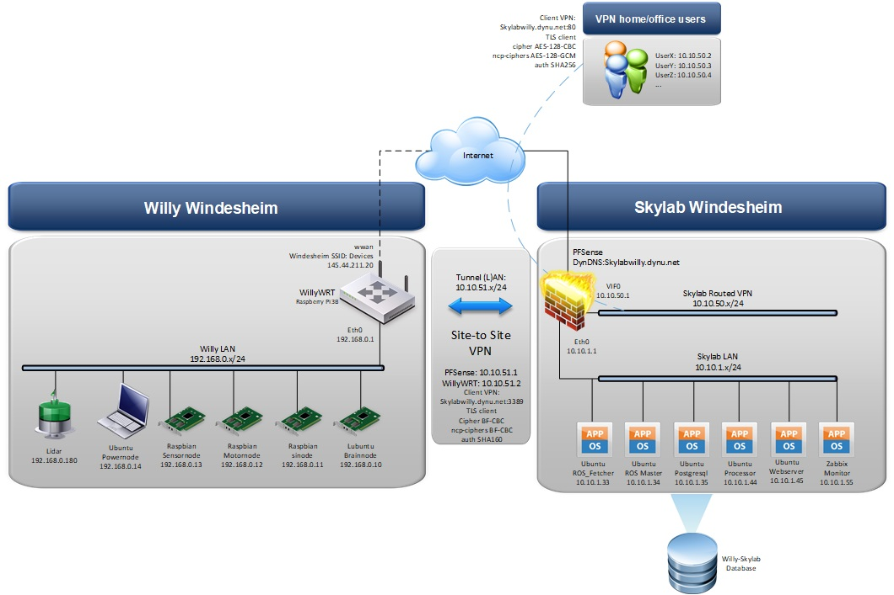

include::../Header.adoc[]

== Hardware Architecture

=== Standpoints

The hardware architecture is design with a set of standpoints just as the software architecture.  
 
* Use low power hardware if possible to save power consumption
* Clustering similar functions on a separate hardware node
* Using multiple hardware nodes ensured non-disruptive node failure
* Functions that can be ran offsite - Skylab - should
* Variations of OS software is possible as long as topic communication is possible
* Variations of ROS software is possible as long as topic communication is possible
* Simultaneous development is possible
* Skylab communicates safely with Willy

=== Design

These standpoints resulted in the following hardware design. 

=== Usability

By having multiple VPN instances, its possible - if all hardware is powered on - to connect through Skylabs to the individual hardware nodes on Willy even if not physically near him. Another option is to physically connect to WillyLAN and access either Skylab or Willy hardware nodes. 

[NOTE]
Designing this architecture and keeping it up to date can be done by editing the vsdx files in Microsoft Visio. 
