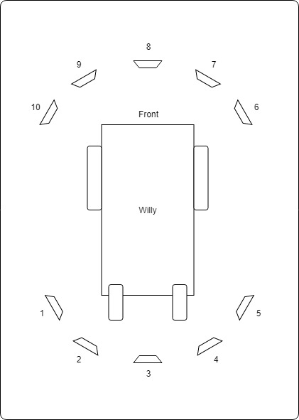
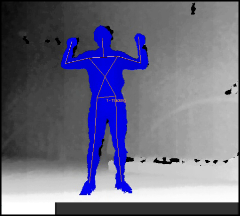
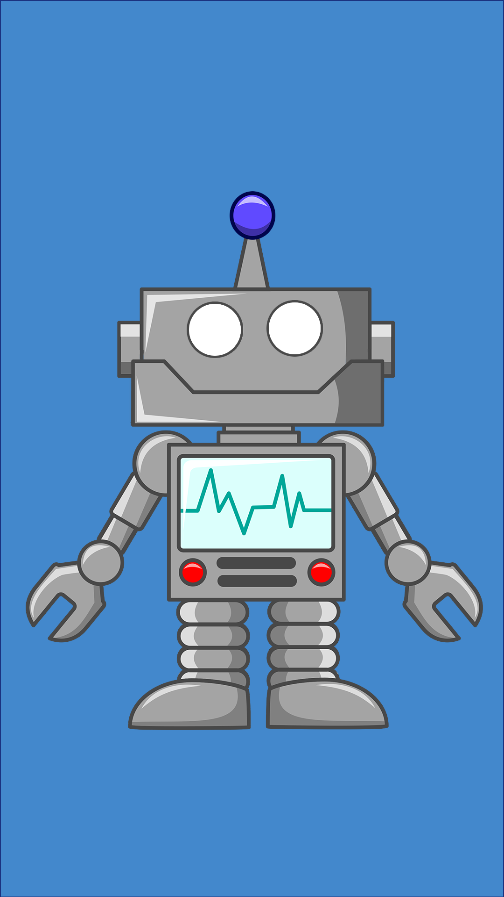
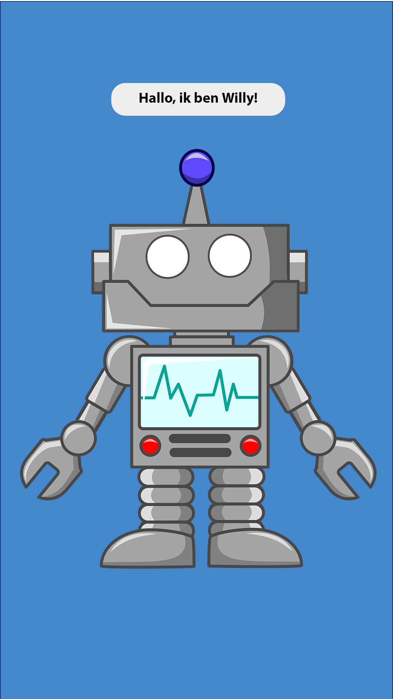
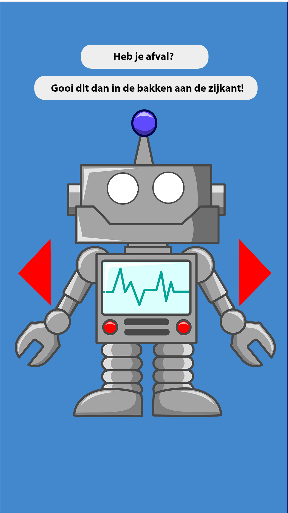
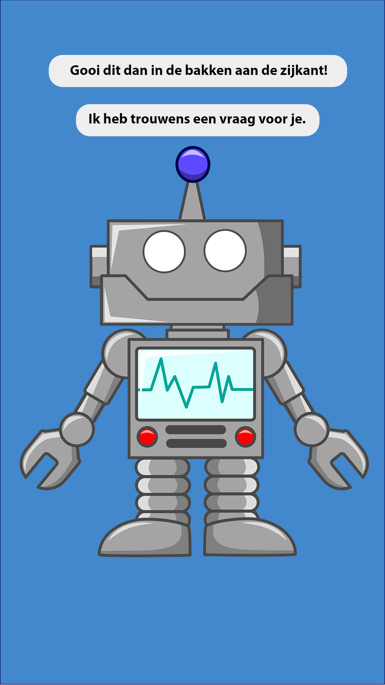
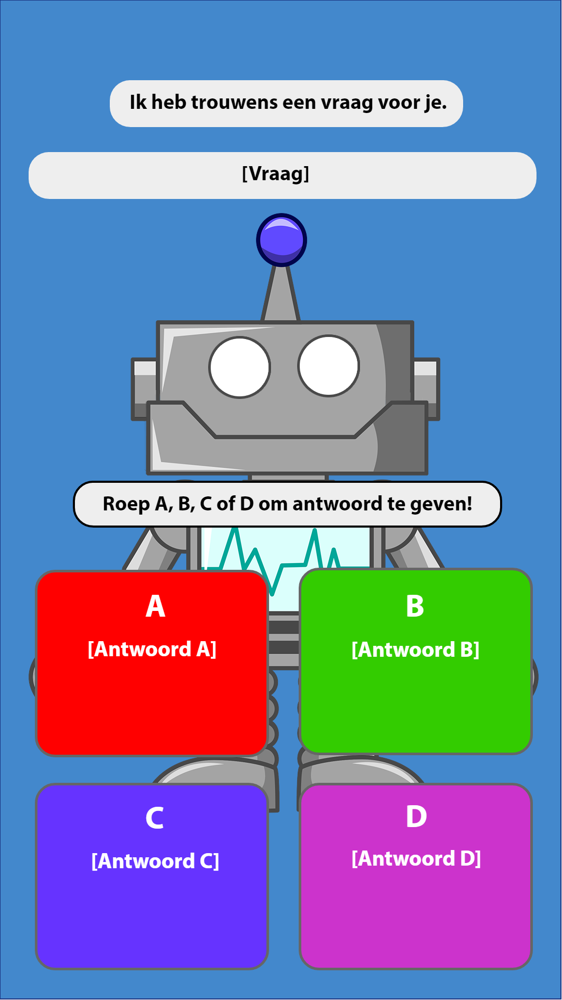

include::../Header.adoc[]
=== Social Interaction

[discrete]
==== Version history

[cols=",,,",options="header",]
|===================================================================
|Version |Date |Person |Note
|V0.1 |03-04-18 |Gerard Zeeman |Created document
|V0.2 |03-04-18 |Gerard Zeeman |Added chapters
|===================================================================

==== Preface
One of Willy's goals is to make people aware of the problems and harmfulness that waste entails. Interaction will be the primary method to fulfill this goal. Interaction between humans and robots can be realized with different technologies and with different strategies.  

===== Means of communication from Willy (Willy to Person)

====== Text
Willy can give information by showing text on his display. This text can be static, depending on the user input. Or the text can be generated by an algorithm

====== Text to speech 
Willy can generate speech by converting text to speech. Nowadays, browsers can fulfill this conversion. If a Chatbot is used, this functionality is mostly included. There are third party variants available. Thirt party text to speech variate from compatibility possibilities, functionality and internet connection requirements.

====== Visuals
Because Willy has an onboard screen available, he is able to display visuals such as images and videos. The use of visuals can help by making people aware of garbage. 

===== Content of communication
Starting a conversation can be done by using different communication-techniques. 

====== Questioning
Willy can ask questions to start a conversation. If the question is answered, Willy can react based on an algorithm. Because the answer depends on the reaction, this method is harder to achieve. However the attention of the person will be drawn more quickly because of the subject of the answer based on the input. 

Another option is to give the end-user different options by asking multiple choice questions. The algortim behind the response will be much simpler. Willy can search for certain words witin the answer to select a certain answer. 

====== Informing
Willy can inform an end-user about the negative influence of garbage to our environment. However the user will not feel he is in a conversation.

===== Initiation of communication
Before Willy is able to communicate with humans. Willy is required to recognize humans. This can be achieved with different techniques. 

====== Object detection
If a person starts to communicate with Willy, Willy should be able to detect there
is a person in front of the robot. One of the possibilities is Willy using its sonar 
sensors to detect a person.

Unfortunately the use of sonar sensors gives a lot of blind spots. Another option is using 
the LIDAR for object recognition. This option gives way more resolution and accuracy. The 
placement of the LIDAR sensor is very important for the efficiency. Boththe sonars and the 
Kinect are not able to detect if the object is actually a person.

The second option uses ROS, ROS contains several packages for detecting and identifying faces, and detecting and tracking humans with RGB-D sensors or laser scanners. Detects persons through head and face detection and identifies the detected faces. The results are tracked over time to increase confidence. The system is optimized to be used with a Microsoft Kinect or Asus Xtion Pro Live sensor but could also handle different sensors as long as depth and color images are provided.

* Advantage: Cob_people_detection can detect and identifying faces. To start a conversation, Willy can for example require to detect a face for a minimum amount of time. No user input is required.

* Disadvantage: The use of this method requires an extra kinect, because the current kinect will be used for navigation and will be located incorrect for people detection. 

Another option is using the Kinect to detect a person. By using the Kinect it is
possible to determine wether the object in front of Willy is a person or an other object.
A disadvantage is the enormous amount of data that has to be processed. The positioning of the 
Kinect is also important.

Last but not least, Willy can draw attention by using his screen. Before he starting a conversation, Willy waits for physical user input from an end user. User input can be a accomplished by using the Lead motion or one of the alternative interaction methods. 

* Advantage: Don't require any extra hardware. There is no extra algorithm required that defines when the attention of a passerby is drawn or not.Last but not least, this method is less error prone

* Disadvantage: This method required the user to (physical) interact with Willy before an conversation is started. 

This can be summarized in the following table:

[cols=",,",options="header",]
|=================================================
|Method |Advantages |Disadvantages
|*Sonar* |Already implemented |Dead spots, slow, no person detection
|*LIDAR* |Fast, high resolution |Position dependent, no person detection 
|*Kinect* |Fast, high resolution, person detection |A lot of data to process, position dependent
|=================================================

===== Means of communication to Willy (Person to Willy)

====== Voice recognition
To make a person be able to communicate with Willy, the robot should be able to listen to
the person by recognizing his or her speech. A good microphone is neccesary for listening to 
sounds and filtering out background noise. An API can be used to convert speech to text.
Voice recognition is a great way to create user interaction, but can be risky if there is
a lot of background noise.

====== Touchscreen
Another way to get user input is a touchscreen. This makes it possible to have buttons and
clickable areas. A touchscreen is a good way to create clear user interaction. A touchscreen is
however heavy and expensive. Another difficulty is the fact that it is hard to make a touchscreen
waterproof and have good responsiveness at the same time. An alternative for a trouchscreen
is a normal screen with al LEAP-sensor in front of it. This is cheaper, lighter and gives more
possibilities.

====== Gesture recognition
By using a LEAP-sensor (see previous paragraph) it is also possible to recognize gestures.
The different gestures can be showed or explained on the touchscreen. This is also possible
with the Kinect, but with somewhat less possibilities.

==== Content of communication
===== Speech bot

A speech bot is designed to process an incoming speech and create answers for the input.
The challenge with a speech bot is creating relevant answers to user input, and some relation with garbage disposal. 
A problem of many existing speech bots is that these bots have an hard time to prevent giving
rude answers. Especially bots created by existing user input reflect this human input.

There are many different existing solutions for speech bots. An import feature these bots must 
have is support for the Dutch language. Here follows a list of options with Dutch support:

[cols=",,,,",options="header",]
|=================================================
|Name |Platform/language |License |Languages |Project link
|*Live Agent* |https://www.ladesk.com/integrations-and-plugins/ |14 day trial |39 languages |https://www.ladesk.com/
|*Semantic Machines* |? |? |Language independent |http://www.semanticmachines.com/
|*Wit.ai* |Node.js, Python, Ruby, and HTTP API |Free |A lot (including Dutch) |https://wit.ai/
|*Api.ai* |Android, iOS, Cordova, HTML, JavaScript, Node.js, .NET, Unity, Xamarin, C++, Python, Ruby, PHP, Epson, Botkit, Java |Free |A lot (including Dutch) |https://api.ai/
|*Microsoft Bot Framework* |.NET and Node.js SDK |Open source |A lot (including Dutch) |https://docs.botframework.com/en-us/
|*Chatfuel* |JSON API, RSS, Subscribe plugin, Digest, IFTTT, Zapier, User input, Live Chat |Free |A lot (including Dutch) |https://chatfuel.com/
|*Chatterbot* |Python, Django |Open source BSD-3 |Langue independent |http://chatterbot.readthedocs.io/en/stable/
|*MyCroft* |Linux, Android |Open source |Dutch not standard implemented but possible to create |https://mycroft.ai/
|=================================================

From these solutions, the free ones should be prioritized. An other important necessity is 
the support of a platform already used in the project. All solutions except Live Agent and 
Semantic Machines are free to use.

===== Self created solutions
Another option is the creation of a custom self built system. The advantage of this is the fact
that it can be runned offline. A disadvantage is that it is more work to creative and might not give
the feeling of social interaction that given by a existing chat bots. However, the main goal is to create awareness about the impact of garbage. A Self created solution may fulfill this task better than a speech bot. 

==== Recommendations
This chapter contains recommendations for the best appliances in communication with Willy.

===== Self created solution
A self created solution can contain, questions, vizuals, video's, information speeches or choices. 

===== Text to Speech

===== Speech to Text
The recommended solution to speech to text is dependent on wether there is internet available on Willy. 
In the case of:

- *Willy having internet*: options like wit.ai or api.ai are great when there is internet available.
These options don't only have a option to generate text from speech, but also have a chat bot function.
- *Willy not having internet:*: A local option like MyCroft works offline, so in that case this is the best option.

===== Speech Bot
The speech bot will be the most interactive solution. A speech bot will also be the most smart and innovative solution, however the use of a speech bot has several disadvantages. 

* A speech bot will mostly give general answers and sometimes give wrong answers. 
* To make the speech bot more smart, internet connection is required. 
* Because the above disadvantages, a speech bot may not be fulfill the main goal of social interaction very efficiently.

==== Screen Designs

==== References

.Websites
- Chatbotsjournal.com. '25 Chatbot Platforms, A Comparative Table'. https://chatbotsjournal.com/25-chatbot-platforms-a-comparative-table-aeefc932eaff.

