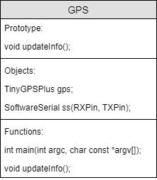

=== Arduino

[discrete]
==== Version history

[cols=",,,",options="header",]
|===============================================
|Version |Date |Person |Note
|V0.1 |08-03-18 |Gerard Zeeman |Created Document
|V1.0 |09-03-18 |Gerard Zeeman |Finished SAD
|===============================================

==== Preface

The following definition list is to clear up confusion about certain
terms used in this document.

[cols=",",options="header",]
|=======================================================================
|_Term_ |_Definition_
|Code conventions |These are rules that are used for programming and
drawn up by the developers of Wake 'Em.

|UpperCamelCase |This means that each word is capitalized. Example:
SetAlarmOfAndroid.

|LowerCamelCase |This means that each word is capitalized except for the
first word. Example: setAlarmOfAndroid.

|Odometry |The technique of measuring the amount of movement of the
wheels with special sensors.

|ROS |Robot Operating System, the framework Willy has been built on.
|=======================================================================

==== System Overview

image:media/Arduino2.jpg[image,width=604,height=238]

ros_gps gps sonar odometry

===== Code Overview

image:media/Arduino5.jpg[image,width=231,height=306]

image:media/Arduino6.jpg[image,width=401,height=298]

image:media/Arduino7.jpg[image,width=291,height=332]

==== Design Decisions

In the past the decision has been made to make the hardware modular.
Unfortunately the reason behind this decision is not documented.

The motor controller (odometry) is made by the group of the second
semester of 2016/17. The odometry code subscribes from the topic
“/cmd_vel” and publishes to the topic “wheel_encoder”. The code reads
the data from the odometry sensors and publishes it to ROS, and writes
data it gets from ROS to the motors.

The sonar code is reading the 10 sonar sensors and publishes it to ROS
on the topic “sonar”. The code has been written by the group of the
second semester of 2016/17.

The GPS and compass code is written by the group of the first semester
of 2017/18. The setup is made ambiguous. The compass has a Arduino and
the GPS has a Arduino. The data from the GPS is sent to the Arduino with
the compass. From that Arduino the data from the Compass and the data
from the GPS is both being published to two separate ROS topics. The
topic with compass data is “compass” and the topic with GPS data is
“gps”. This setup has not been fixed yet.

==== Bibliography

*The current document contains no sources.*
