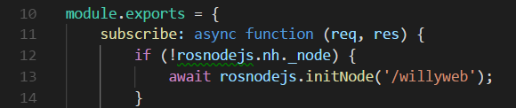
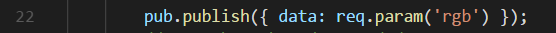

include::../Header.adoc[]

== RosNodeJs

=== Introduction
RosNodeJs is a framework in which you can create real ROS Nodes. It is good to have basic knowledge about ROS before reading any further. This can be read on the Wiki and at the official website link:http://www.ros.org/[].

RosNodeJs lacks in a proper documentation but the official wiki is available on ROS’s own website, see link:http://wiki.ros.org/rosnodejs/overview[].

RosNodeJs functions as a ROSPackage, the instance of WillyWeb is run as a RosPackage named ‘willyweb’. However you are able to run multiple instances of the Rospackage ‘willyweb’ for example if you run multiple scripts.

=== Advantages/disadvantages

=== How to use
==== Declaration
Ros is used as a NPM package and is loaded into a controller using the following code:
image:../assets/social_interaction/image18.png[]
Here in the first line of code RosNodeJs is loaded into the constant variable ‘rosnodejs’. In the second line the type of message is defined, in this case ‘sensor_msgs’.

==== Node Handle
In the following section of code these variables are used as following:

In the third line of code you can see an if statement that checks if a so called Node Handle already exist. A Node Handle is the Node on which the platform operates, you could also see this as the Rospackage ‘willyweb’ but then in a active node. You would expect that this is not needed because you require the same RosNodeJs module across the application but research found out this does not work as of the moment of writing.

If a Node Handle already exits the node can be accessed using ‘rosnodejs.nh’. If this Handle does not yet exist it awaits the creation of it using ‘rosnodejs.initnode(‘/willyweb’)’.

The main reason this is done each time RosNodeJs is used in the code is because the same instance must be used over the whole application. Multiple Node Handles cannot coexist. The official examples given are also written inside one function, this is not practical for a well designed application. Another solution was therefore to create a RosController in which all communication with Ros would be done. The main disadvantage of this is that you’ll have to create a function for each and every message type used throughout the application which violates the Single responsibility principle in the SOLID principles.

==== Subscribing
If the Node Handle is initialised we can use the various functions ROS uses, for example subscribe:
image:../assets/social_interaction/image20.png[]
In the first line the subscribe method is called with the first parameter being the topic on which it must subscribe ‘/sonar’ and next up the message type ‘msg.LaserEcho’ after that the function is declared on what to do when data is published on the topic. This data is stored in the local variable ‘data’, in the current situation it would blast an update over the socket that new data is available. This update also contains the new data received form the topic.

==== Advertise
Before being able to publish onto a ROS topic we first need to advertise that we are going to publish data. This is done using the advertise function on the Node Handle:
image:../assets/social_interaction/image21.png[]
First a variable is made so that the advertise topic can be reused inside the controller.
image:../assets/social_interaction/image22.png[]
After that the variable is filled with a advertise topic, the function advertise consist out of 2 parameters in this case the topic to advertise on ‘/led’ and a message type ‘msgs.ColorRGBA’.

==== Publishing
After the initialisation of the advertise topic the following function is used to publish data onto this ROS topic:

In this example the earlier variable ‘pub’ is reused to call the function publish on the advertise topic. This function contains the data in JSON format that needs to be published onto the topic. Make sure this data is coherent to the official format used by the specific message type which can be found at ROS official wiki: link:http://wiki.ros.org/common_msgs?distro=kinetic[]

=== Implementation
