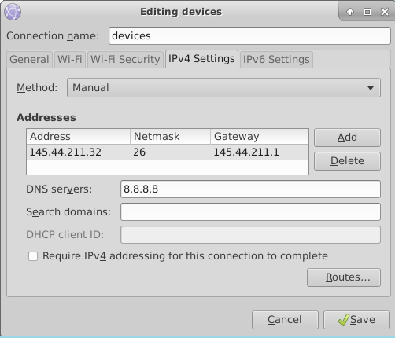
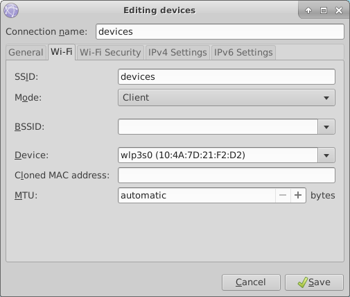

include::../Header.adoc[]
== Operation system of Willy

Currently, Willy is operating using ‘Linux Ubuntu 14.04’ as operation
system. The ROS-framework is used for centralized communication between
nodes. Nodes are referred as different software/hardware components of
‘Willy, think of; GPS, sensors, compass and software functions. Some
nodes may require ‘dependent-ROS-packages’. To execute and compile
software nodes, these packages are required. Both ROS and dependencies
require the same version. The current version of ROS is ‘ROS-kinetic’.

=== Current installed packages

The first step in updating the OS is to determine which packages and
dependencies are installed. Because previous teams have made a lot of
changes to ‘Willy’, not all Linux packages may be still required. To
list the manual installed packages, the following command was used.

_comm -23 <(apt-mark showmanual | sort -u) <(gzip -dc
/var/log/installer/initial-status.gz | sed -n 's/^Package: //p' | sort
-u)_

The following packages where manually installed;

[source,text]
----
brightness-controller
dhcpcd5
dotnet-sdk-2.0.0
git
google-chrome-stable
htop
nmap
openssh-server
pgadmin3
postgresql
python-pip
*ros-kinetic-desktop-full*
*ros-kinetic-joystick-drivers*
*ros-kinetic-rosbridge-server*
*ros-kinetic-rosserial-python*
*ros-kinetic-rosserial-server*
*ros-kinetic-teleop-twist-joy*
*ros-kinetic-teleop-twist-keyboard*
*ros-lunar-catkin*
*screen*
vsftpd
x11vnc
xfce4
xrdp
----

Some of the above packages are required to compile and execute the
‘WTGD’ code that is available from GIT, these packages are bold listed.
Other packages may be required for the web platform or may have another
goal than compiling and executing ROS code. In this project there will
be major changes in the web platform, because some of the code will be
changed, dependencies will be determined during the development of the
code. Other packages are explained in documentation that will be
available with the final delivery.

=== Determined packages for Ubuntu 16.04 and ROS-kinetic

To create a clear view about the current ‘WTGD’ code that ‘Willy’
contains, and how this works on Ubuntu 16.04 with ROS-Kinetic, a test
environment was created. None of the previous listed packages where
installed, only Ubuntu 16.04 was installed and the ROS-framework on top
of this. The code was not able to build successful in this test
environment, however based on the error messages, dependencies where
determined. Every time a decency was missing, the error massage was
inspected. We concluded that the following packages are required to
execute the ‘WTGD’ code on Willy.

[source,text]
----
ROS-kinetic-desktop-full
Screen
ROS-kinetic-rosserial
ROS-kinetic-rosserial-arduino
ROS-kinetic-rosapi
ROS-kinetic-rosbridge-server
----

=== Install dependencies

To install above dependencies, the following commands are required.

Install Ross

[source,shell]
----
sudo sh -c 'echo "deb http://packages.ros.org/ros/ubuntu $(lsb_release
-sc) main" > /etc/apt/sources.list.d/ros-latest.list'
----

[source,shell]
----
sudo apt-key adv --keyserver hkp://ha.pool.sks-keyservers.net:80
--recv-key 421C365BD9FF1F717815A3895523BAEEB01FA116
----

[source,shell]
----
sudo apt-get update
sudo apt-get install -y ros-kinetic-desktop-full
sudo rosdep init
rosdep update
----

Link the ros framework to the ubuntu bash 

[source,shell]
----
echo "source /opt/ros/kinetic/setup.bash" >> ~/.bashrc
source ~/.bashrc
----

Start a new bash prompt and run (test)

[source,shell]
----
roscore
----

Install ROS-dependencies

[source, shell]
----
sudo apt-get install Screen
sudo apt-get install ros-kinetic-rosserial
sudo apt-get install ros-kinetic-rosserial-arduino
sudo apt-get install ros-kinetic-rosapi
sudo apt-get install ros-kinetic-rosbridge-server
----

Give user permission to access USB ports

[source,shell]
----
sudo usermod -a -G dialout willy
----

With the above installation changes made to Ubuntu, the current ‘WTGD’
code was able to run. Packages listed in the 11.1. can be used as
reference material.

=== Devices network

The following information can be used to connect with the 'devices' wifi-network at Windesheim.

IP-adres: 145.44.211.32
Subnet mask: 255.255.255.192
Default gateway: 145.44.211.1
DNS: 8.8.8.8

An connection can only be made with the following MAC address. If this is changed, please ask the support-desk of Windesheim to change the MAC-address.

MAC: 10:4a:7d:21:f2:d2

The configuration on Willy is as shown below

== Install Snowboy

`curl -sL https://deb.nodesource.com/setup_9.x | sudo -E bash -`

`sudo apt-get install -y nodejs`

`sudo apt-get install -y build-essential`

`sudo apt-get install python-pyaudio python3-pyaudio sox`

`pip install pyaudio`

`sudo apt-get install libmagic-dev libatlas-base-dev`

`git clone https://github.com/ArtOfRobotics/Speechtest.git`

`cd Speechtest`

`node server.js`

== Remote access
=== RDP
The following configuration was used when RDP was deployed by using XRDP and XFCE4 

[source,text]
----
sudo apt-get install xrdp
sudo apt-get install xfce4
----

Edit .Xsesion file in home directory 

[source,text]
----
echo xfce4-session >~/.xsession 
----

Edit XRDP configfile: “/etc/xrdp/starwm.sh” for using XFCE4 

[source,bash]
----
#!/bin/sh
if [ -r /etc/default/locale ]; then
  . /etc/default/locale
export LANG LANGUAGE
fi
startxfce4 
----

Fix the Tab button by editing: 

[source,text]
----
~/.config/xfce4/xfconf/xfce-perchannel-xml/xfce4-keyboard-shortcuts.xml 
----
Replacing 
[source,text]
----
<property name="&lt;Super&gt;Tab" type="string" value="switch_window_key"/> 
----
By
[source,text]
----
<property name="&lt;Super&gt;Tab" type="string" value="empty"/> 
----

=== Openssh server
Install open-ssh

[source,]
----
sudo apt-get install openssh-server 
----
Enable ssh on boot
[source,]
----
sudo systemctl enable ssh
----

[bibliography]
=== References
- link: {url}/Documents/#_inventorisement_current_status

