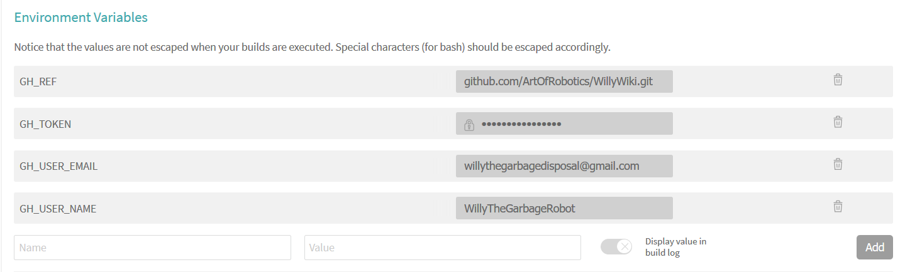
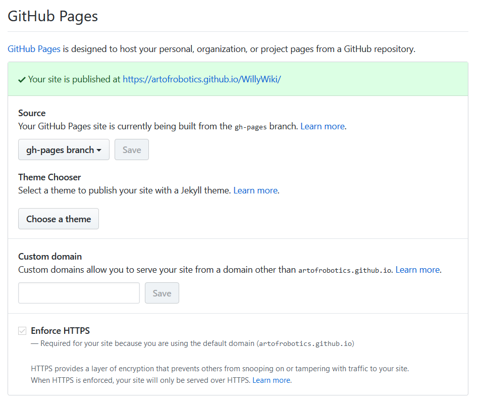

include::../Header.adoc[]

image:https://travis-ci.org/Windesheim-Willy/WillyWiki.svg?branch=master["Build Status", link="https://travis-ci.org/Windesheim-Willy/WillyWiki"]

== Willy Wiki
This wiki is setup to increase the transferability of the project. Everything you need to start is documented here.
Detailed documents are referenced trough the wiki if you need more information.

=== Introduction
The wiki is setup using AsciiDoc, TravisCI & Github pages. In practice we use AsciiDoc as source code, TravisCI to convert to html/pdf and Github Pages for publishing the website. This is visually shown in the image below, this is taken from the http://mgreau.com/posts/2016/03/28/asciidoc-to-gh-pages-with-travis-ci-docker-asciidoctor.html[tutorial]
we followed.

image::http://mgreau.com/posts/images/cover-asciidoc-ghpages.svg[AsciiDoc to Github Pages with Travis and Docker Asciidoctor,950]

=== Why AsciiDoc
Why AsciiDoc is chosen as our markdown language. During the search for a good Wiki tool, we eventually stumbled upon Github Pages. Github pages in intended to automatically publish markdown for you as a html site and you can add more functions by Using Jekyll. However quickly limitations in Markdown where found and the Jekyll implementation made if far more complex due to different plugins. That's why it is decided to use AsciiDoc at it's raw form.

This is directly the main advantage of using Markdown, while you can use plugins it's main functionality makes it the perfect language for creating a Wiki. In terms of markdown languages you can follow this list as a rule of thumb:

* Markdown (MD)
** Is the most simplest markdown language out there, but is also it's main weakness
* AsciiDoc (Adoc)
** Is more versatile in the basics and much more rich in terms of formatting and plugins
* LaTex (Tex)
** Is more professional focussed and contains a lot of functions at its core where in other markdown languages you need plugins

This should also clarify the reason that AsciiDoc is chosen as the source language of this Wiki. <<Markdown vs AsciiDoc>>

=== How the Wiki is setup using AsciiDoc with TravisCI and Github Pages
The wiki is setup fairly easy, especially when you know your way around Github and TravisCI. So it is important to read into these topics if you don't know what these tools mean. And for AsciiDoc you'll learn it along the way as we did.

=== Conversion
As told in the <<introduction>> AsciiDoc is used as a source language, which then can be converted to whatever format you like. Most commonly HTML and PDF.

==== Travis
Travis is setup to convert all documents recursively to HTML and to PDF.

===== Setup
Before you can use Travis you must give travis acces to the repository, this is already done using Willy's Github account.
The following environment variables must be set for the script to work properly.

===== Config
The config file used by TravisCI is link:https://raw.githubusercontent.com/Windesheim-Willy/WillyWiki/master/.travis.yml[travis.yml]. If you are not familiar with Travis it basically asks you for the following:

* Some config elements (Setup)
** as of what kind of acces methods and what services you'd like to use
* What to do before installation (Before)
** Defined under before_installation
* What script to run (Execution)
** Defined under script:
* What to do after the script has run (After)
** Defining after_error:, after_failure:, after_success:

For this script a link:https://www.docker.com/[Docker] container is used specially made for link:https://asciidoctor.org/[Asciidoctor], the tool used for AsciiDoc conversion. You do not need any docker knowlegde to use this script because it uses a readymade Docker container. In this container the asciidoctor commands are executed.

Currently the link:https://raw.githubusercontent.com/Windesheim-Willy/WillyWiki/master/.travis.yml[Travis Config] is setup as follows:

*Setup:* +
Use of docker and sudo acces
[source, yml]
sudo: required

services:
  - docker
*Before:* +
Make a output directory and pull the readymade Docker container.
[source, yml]
----
before_install:
  - mkdir -p output
  - docker pull asciidoctor/docker-asciidoctor
----
*Execution:* +
Here is where all the documents are converted what basically comes down to this command:
[source, bash]
----
asciidoctor -a allow-uri-read *.adoc
----
With docker it looks like this in the link:https://raw.githubusercontent.com/Windesheim-Willy/WillyWiki/master/.travis.yml[travis.yml]
[source, yml]
----
script:
  - docker run -v $TRAVIS_BUILD_DIR:/documents/ --name asciidoc-to-html asciidoctor/docker-asciidoctor asciidoctor -a allow-uri-read **/*.adoc
  - docker run -v $TRAVIS_BUILD_DIR:/documents/ --name asciidoc-to-html-root asciidoctor/docker-asciidoctor asciidoctor -a allow-uri-read *.adoc
----

[NOTE]
--
Because these commands do not allow for recursive generation more than one folder deep some more lines are added to make sure the Archive folder is converted. A better fix stil need to be implemented.
--

[CAUTION]
--
If the build is failing probably a root heading is used somewhere. This can cause conflicts with the sidebar configuration and is only used in the welcome document.
[source, adoc]
----
= This is a root heading
== This heading should be used troughout the wiki for the main chapters
----
--

*After:* +
Your general logging
[source, yml]
----
after_error:
  - docker logs
after_failure:
  - docker logs
----
The publishing to Github Pages
[source, yml]
----
after_success:
  - find . -name '*html' | cpio -pdm output ;
  - find . -name '*png' | cpio -pdm output ;
  - cd output ;
  - git push
----
Here the output folder contains all the converted documents in html files, but still the images need to be copied, else the images would not be shown. Everything that is copied into the output folder is then pushed to the gh-pages branch on GitHub.
As you can see in the link:https://raw.githubusercontent.com/Windesheim-Willy/WillyWiki/master/.travis.yml[travis.yml] used some more actions are done by Travis to ensure everything works properly.

[CAUTION]
--
For the sidebar to scale correctly we had to manualy add the toc classes because we do not use Docbook (yet). Also see <<Recursive replace>>.
[source, yml]
----
  - find -name "*.html" -exec sed -i 's/class="article"/class="article toc2 toc-left"/g' {} +
----
--

[NOTE]
--
For conversion from Word to AsciiDoc you can use link:https://pandoc.org/[Pandoc] to convert word documents or any other format to AsciiDoc fairly easy.
The following command can then be used after Pandoc is installed:
[source]
----
pandoc -f "input.docx" "output.adoc"
----
--

[TIP]
--
To convert all documents recursively in the current folder you can use the following script: (Windows)
[source, BATCH
----
for /r %%v in (*.docx) do pandoc -f "%%v" "%%v.adoc"
----
--

=== Publishing
The end result of the Travis script is a folder with html files which can then be hosted on any server even offline.

==== Github Pages
To do this we use Github Pages, as this is a free service and is perfect for hosting a static html site. It also helps keeping a history of changes.

This is configured as following:
. Go to Github, link:https://github.com/Windesheim-Willy/WillyWiki/settings[WillyWiki Settings] page
. Scroll down to Github Pages
. Set branch to 'gh-pages' and you are done

=== Further reading

The Asciidoctor wiki is a good source, you also might notice the familiar look
link:https://asciidoctor.org/docs/user-manual/#introduction-to-asciidoctor[]

[TIP]
A hardcoded sidebar is used to avoid using Docbook, it might be worth to take a look at this format as it is being used by the official sources as well. The main disadvantage of this is that it makes the Wiki one long HTML page with a large index, however for PDF export this would be fabiolous. See link:https://asciidoctor.org/docs/user-manual/#introduction-to-asciidoctor[Asciidoctor Wiki] as an example.

[bibliography]
=== References

- [[[Tutorial]]] link:http://mgreau.com/posts/2016/03/28/asciidoc-to-gh-pages-with-travis-ci-docker-asciidoctor.html[Maxime Gréau. Convert AsciiDoc to HTML/PDF & publish to GitHub Pages with Travis CI and Asciidoctor Docker containers]
- [[[Markdown vs AsciiDoc]]] link:https://asciidoctor.org/docs/user-manual/#comparison-by-example[Asciidoctor, Markdown vs AsciiDoc]
- [[[Recursive replace]]] link:https://superuser.com/questions/428493/how-can-i-do-a-recursive-find-and-replace-from-the-command-line[Stackoverflow, Recursive replace]
