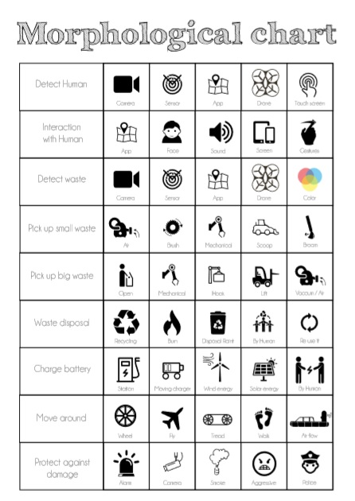
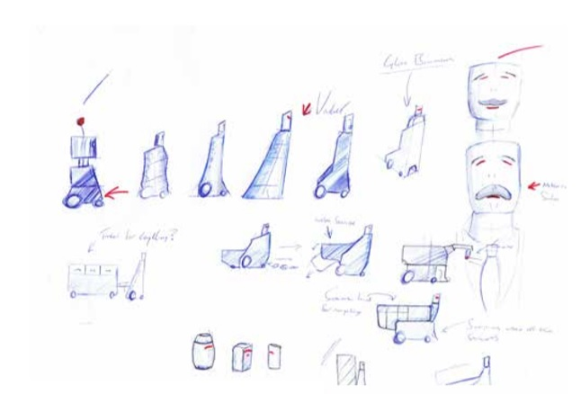
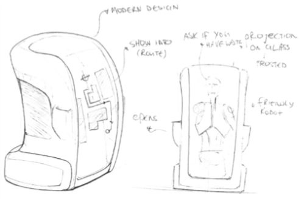
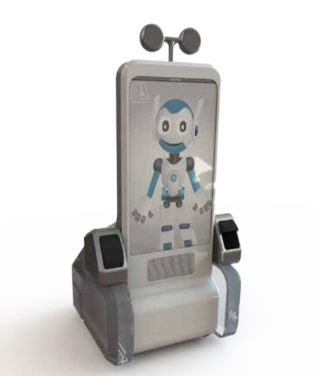

include::../Header.adoc[]

== Background

The original design is made by students of Industrial Product Design. One of the first things they produced was a morphological chart. The chart is made to create an overview of all options and functions of the robot. 

With the morphological chart in mind they started brainstorming and made sketches from the ideas they had.

One of the early designs is the one below. In this design a large tv screen is already installed. The idea of a butler like robot came to mind. Willy has to be polite, informative and have a strong character.

Because of the complexity the idea above was not realistic to make as a prototyping project. This is one of the reasons why they made a less complex version which certainly is realistic to make.

