include::../Header.adoc[]

== Realisation

=== Steel work
==== Frame

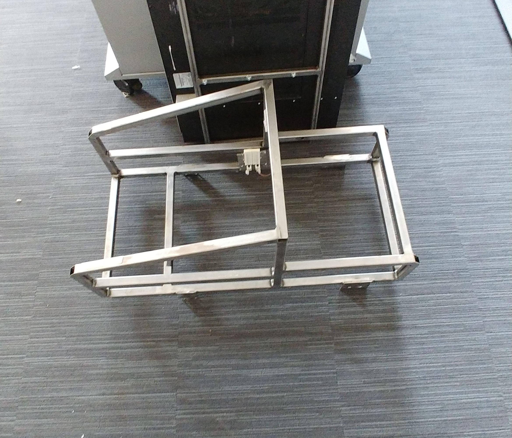

==== Mounting

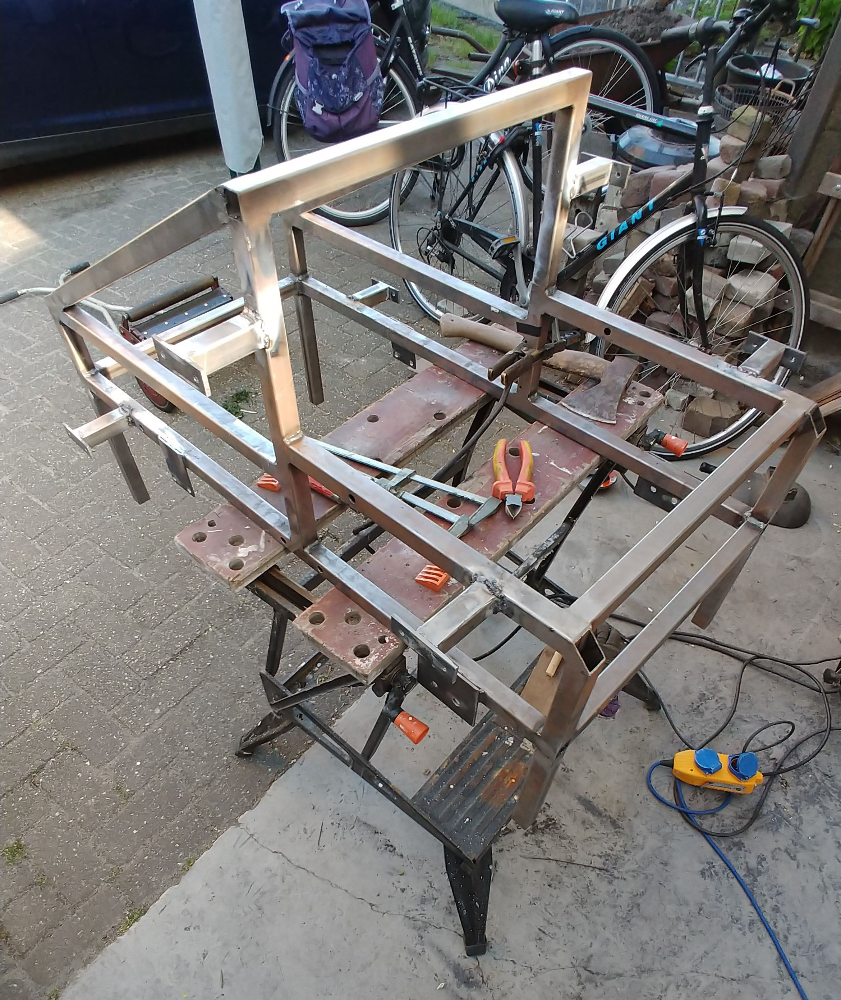

==== Bumper preparation

=== Mold
==== Wooden frame

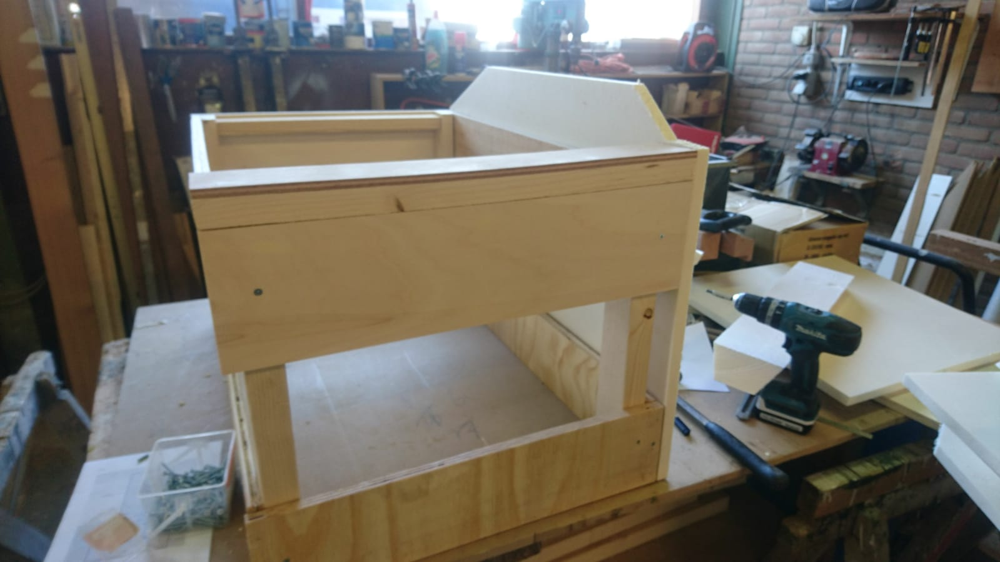
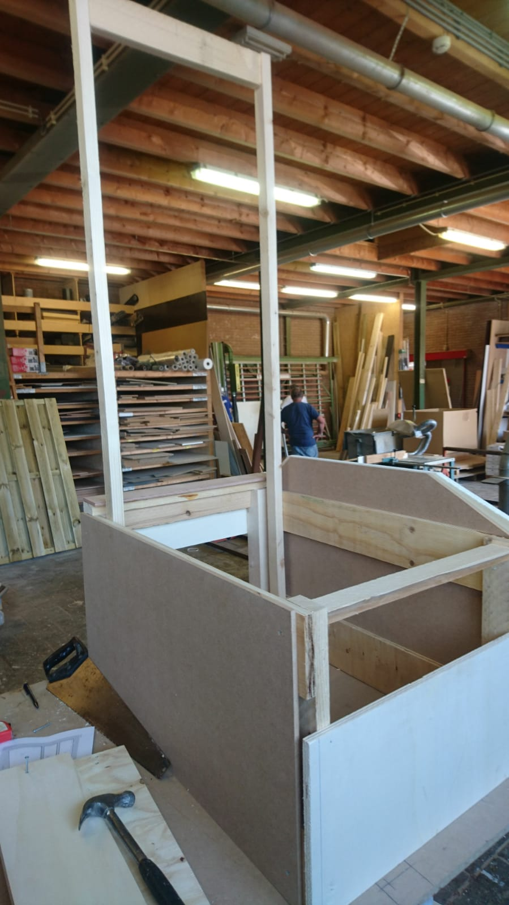

==== Styrofoam board

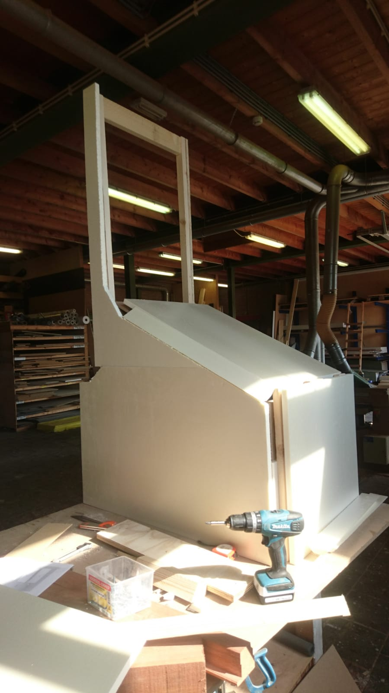
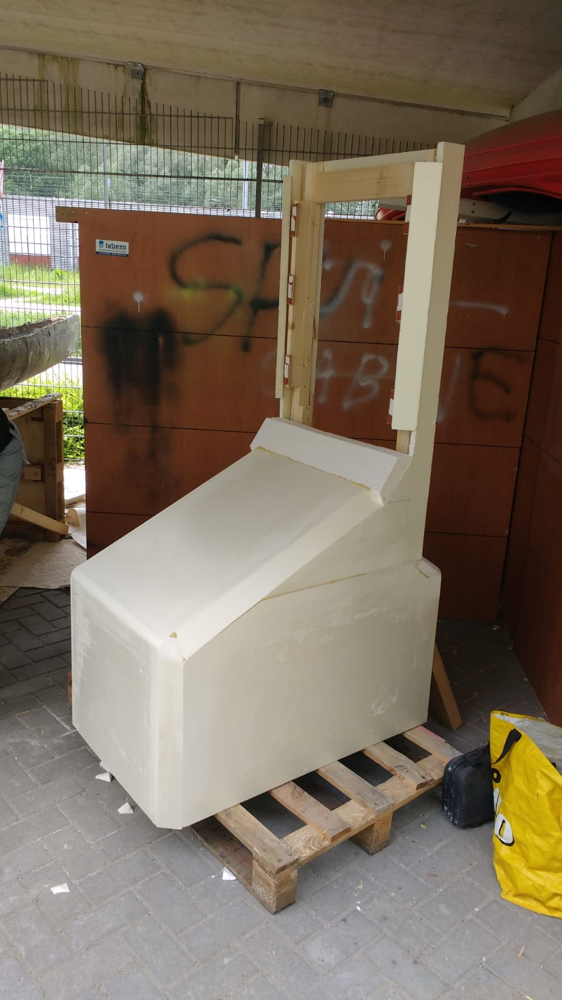
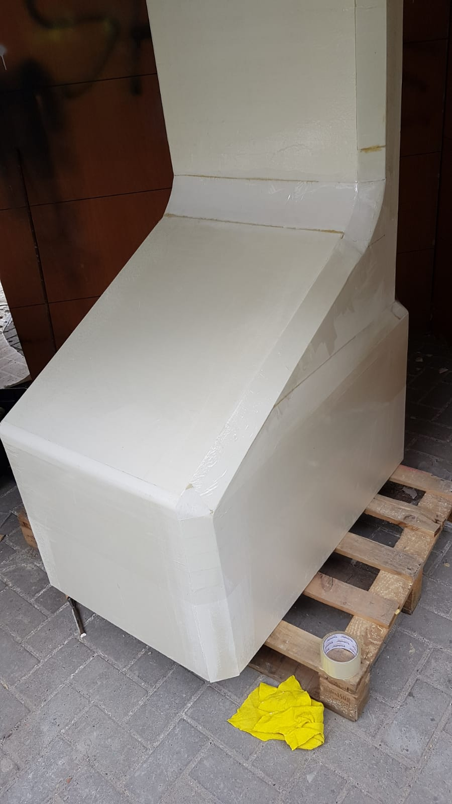
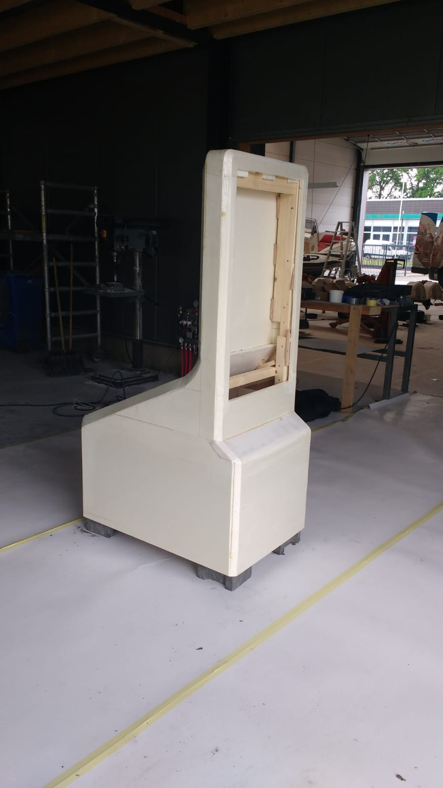

=== Polyester work

We used the workshop of Koers Polyester Techniek in Nieuwleusen. http://koerspolyestertechniek.nl/

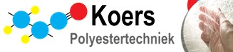

The mold is covered with glass fiber and polyester resin. Starting with one base layer with a 225 gr/m2 and following with four layers of 600 gr/m2. 

==== Preparation

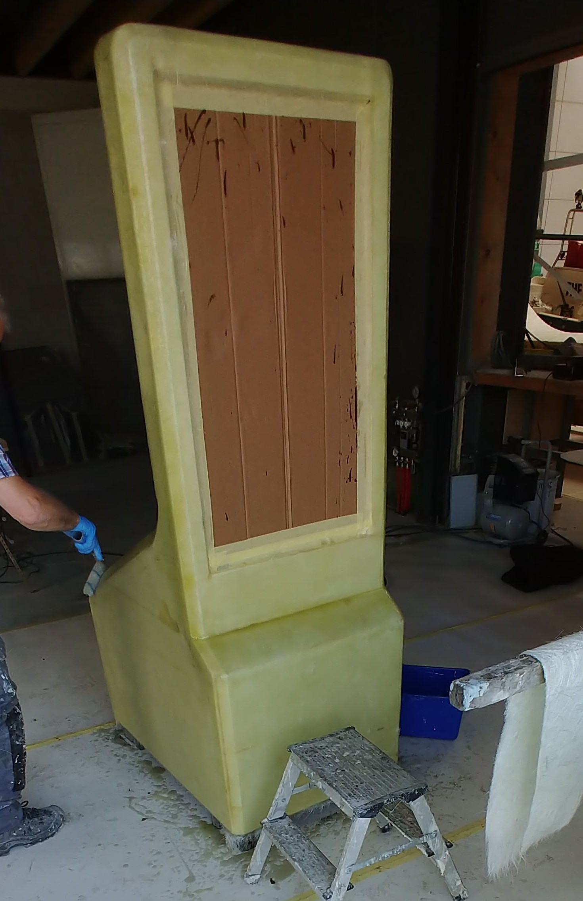
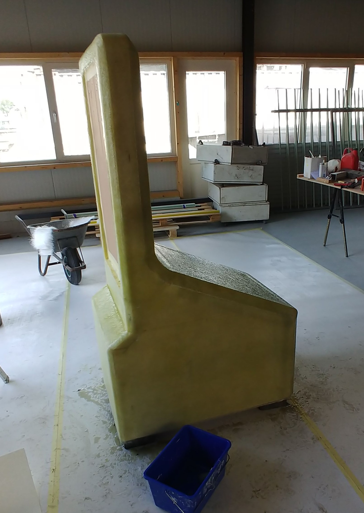

==== Polyestering

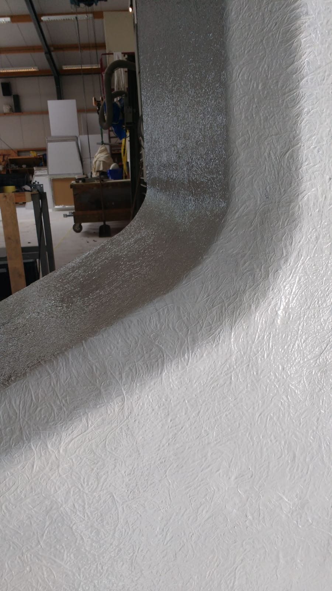
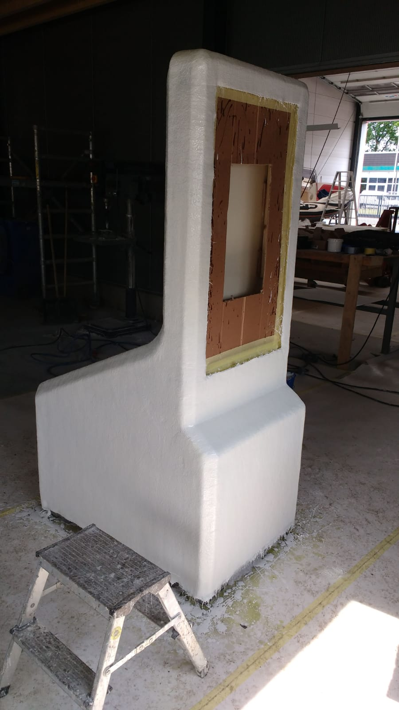
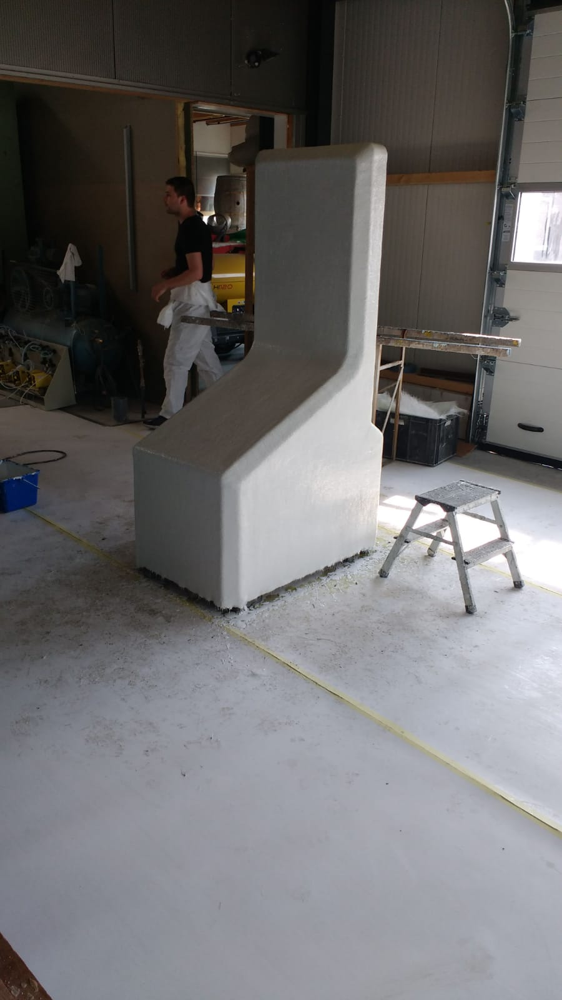

==== Sanding/Sawing/Filling

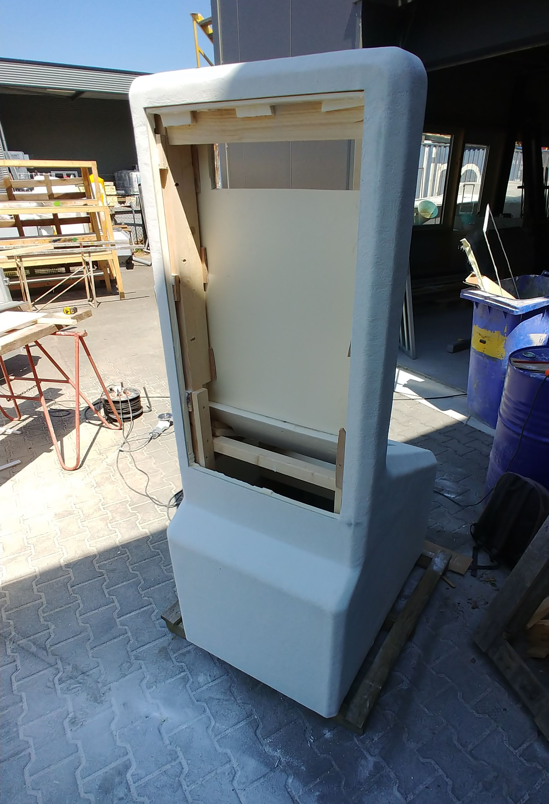
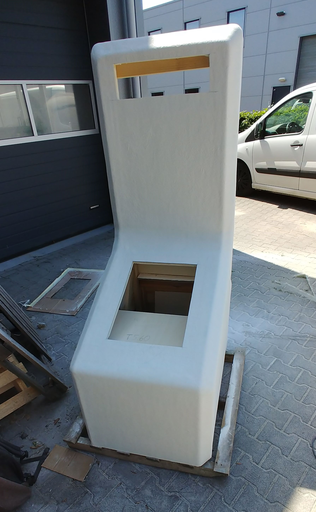

