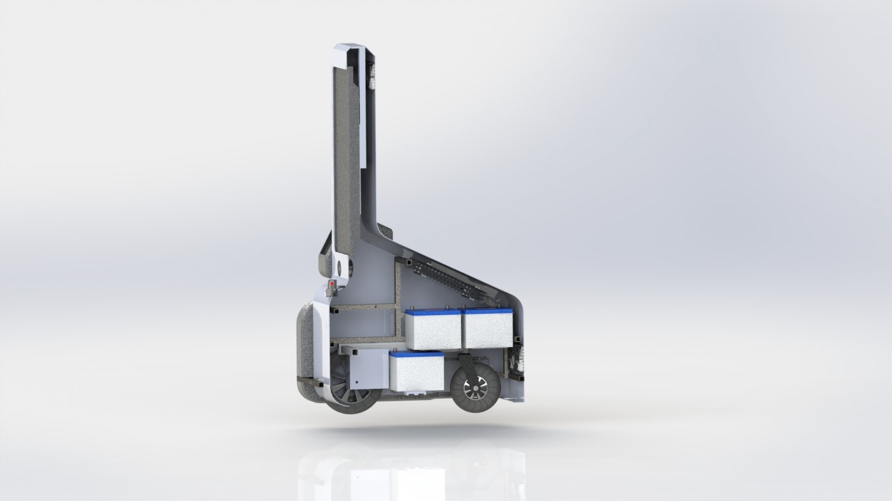

include::../Header.adoc[]

=== Preface
==== Purpose of this document
This document is our Technical Design Document for the project: Willy the garbage robot. It provides guidance and documentation for design choices and an overview of the current parts of Willy. This document could be useful to read for following project groups and other interested parties.

==== Document Structure
The document’s structure contains a paragraph per subject.
-	System overview
-	Parts overview
-	Design choices
The system overview describes the robot assembly with each part included. It has a final render of the robot and describes the functionality. 
Parts overview has a subparagraph for each part made in SolidWorks. Most of the subparagraphs contains a final render of the part and drawings with the most important dimensions included. 
The paragraph Design choices contains the choices we (and earlier groups) made about the parts and the whole robot.

==== Definition List

[width="100%"]
|====================
| Part | SolidWorks file which is a 3D drawing of a part of the robot. 
| Drawing	 | 2D drawing of a Part which contains dimensions 
|Assembly  |3D SolidWorks file which contains multiple Parts which are tied together with ‘mates’  
|
Render  | JPEG image file of a Part or Assembly in high resolution. 
|====================

== System overview

The render below contains all the parts and sub-assemblies that are included in our design. The 42” Display is used for interaction with people and as a way to bring information about the garbage problem and the robot. The speakers in the front are used to let Willy speak and can be used for the sound when displaying a video.

image::media/image1.jpg[]

The bins on each side of Willy will be used to encourage people to throw away their garbage. Willy will ask for trash.

The Kinect is used to look for people (skeletons) so that Willy can interact with them. The LiDAR which is placed on the front of the robot is used for indoor navigation and might be used for outdoor obstacle detection. 

Behind the LiDAR there is a LEAP-motion controller which can be used to control the display with gestures.
The bumpers in the front and in the back of the robot is filled with ultrasonic sensors. Six in the front, six in the back and four downwards to look for kerbstones  and potholes. Inside the robot there are six 60Ah car batteries which supply the necessary power. In the rear and top of Willy there are fans to cool the whole robot. 

image::media/image3.jpg[]