include::../Header.adoc[]

=== Definition List

[width="100%"]
|====================
| Part | SolidWorks file which is a 3D drawing of a part of the robot. 
| Drawing	 | 2D drawing of a Part which contains dimensions 
|Assembly  |3D SolidWorks file which contains multiple Parts which are tied together with ‘mates’  
|
Render  | JPEG image file of a Part or Assembly in high resolution. 
|====================

== System overview

The render below contains all the parts and sub-assemblies that are included in our design. The 42” Display is used for interaction with people and as a way to bring information about the garbage problem and the robot. The speakers in the front are used to let Willy speak and can be used for the sound when displaying a video.

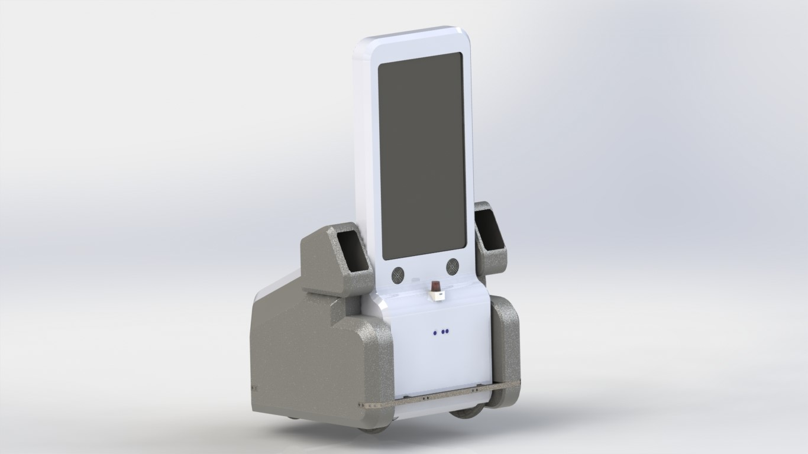

The bins on each side of Willy will be used to encourage people to throw away their garbage. Willy will ask for trash.

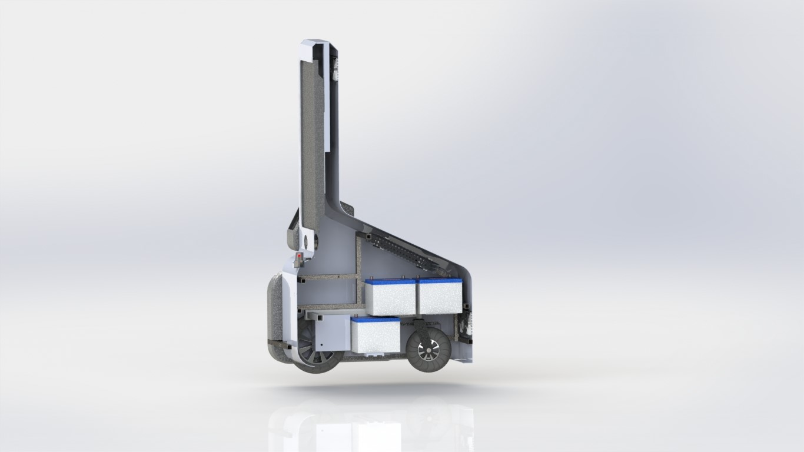

The Kinect is used to look for people (skeletons) so that Willy can interact with them. The LiDAR which is placed on the front of the robot is used for indoor navigation and might be used for outdoor obstacle detection. 

Behind the LiDAR there is a LEAP-motion controller which can be used to control the display with gestures.
The bumpers in the front and in the back of the robot is filled with ultrasonic sensors. Six in the front, six in the back and four downwards to look for kerbstones  and potholes. Inside the robot there are six 60Ah car batteries which supply the necessary power. In the rear and top of Willy there are fans to cool the whole robot. 

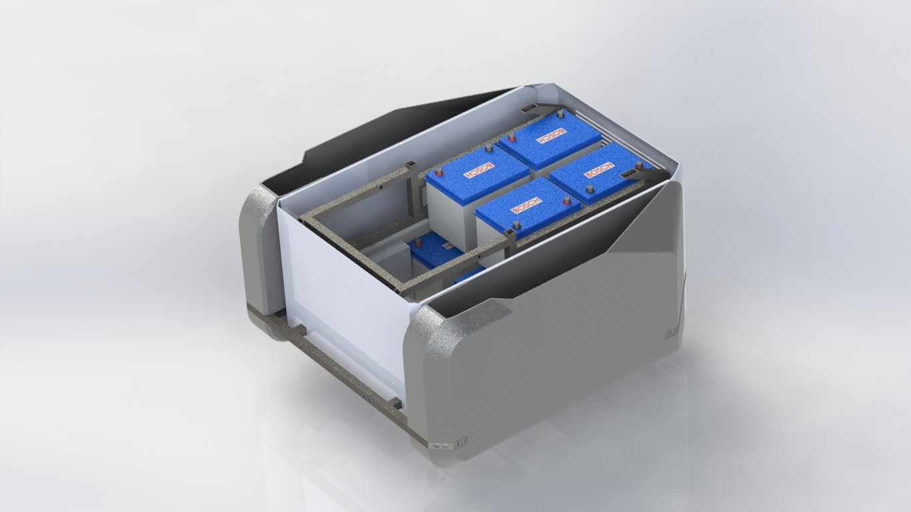

== Part & assembly overview
===  Part 1 front plane

The front plane is one of three pieces which are made out of glass-fibre in combination with a polyester resin. A mould is made out of Styrofoam plates. The front plane contains the tv screen, place for a Kinect sensor, a LEAP motion controller, a SICK TIM551 LiDAR and two speakers with grills. The frame goes through the two holes at the bottom of the front plane.

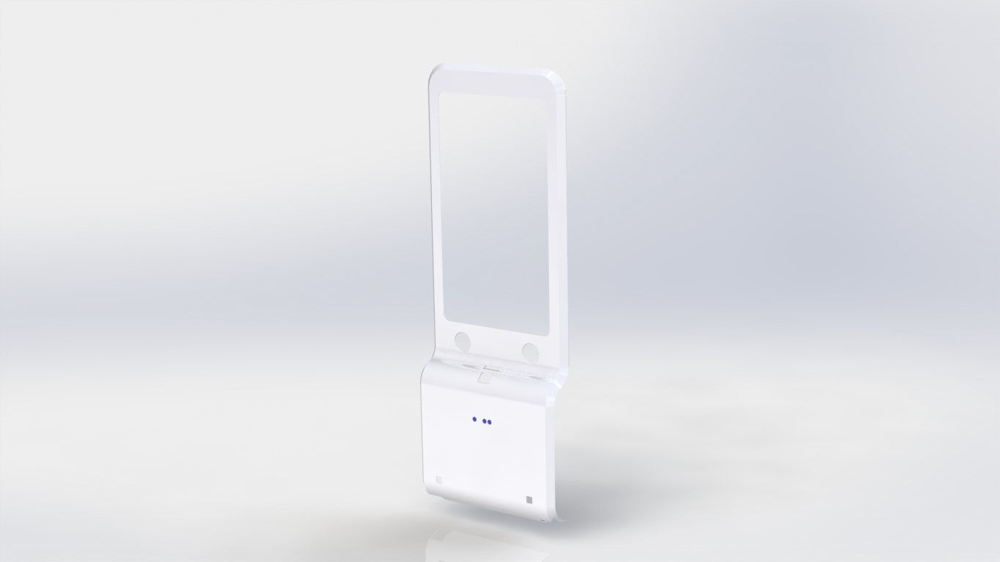

This part is made together with the midplane and backplane using the same mould. The front plane is fixed by the front of the frame.

=== Part 2 midplane

The mid plane is a frame on which the front and back plane are fixed. There are possibilities to fix the tv screen as well. At the bottom there are notches for the swivel wheels on both sides.

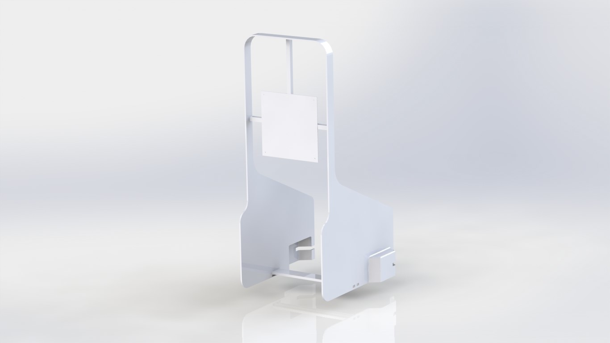

The midplane is made together with the front and backplane with the same mould.

===	Part 3 backplane

The backplane contains slots where the fans can be placed. The design of the backplane improves the flow of air from the bottom to the top of the robot where the air is blown out.

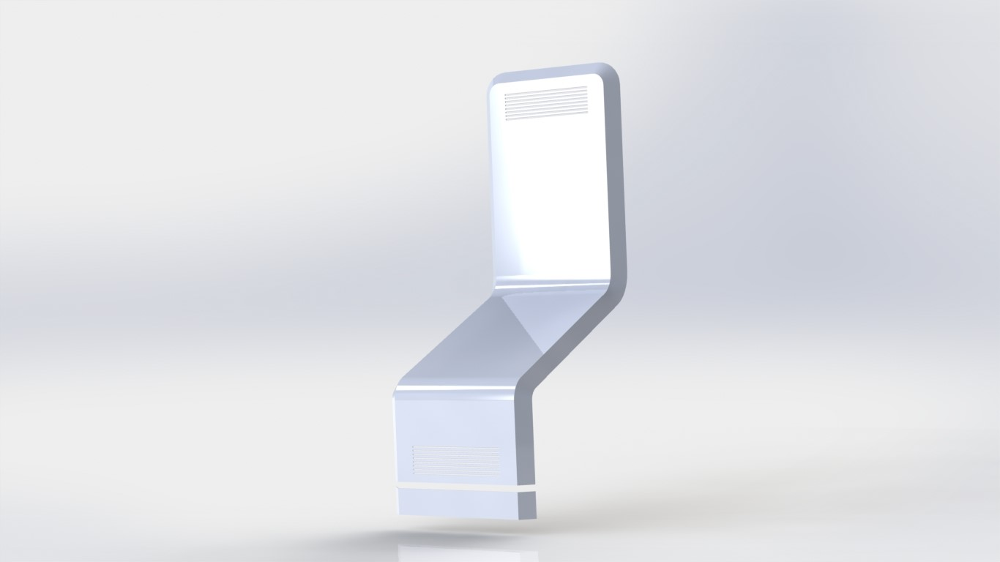

The slanted part is used as a hood so there is still a possibility to work on the electronics. The backplane is made together with the front plane and midplane with the same mould.

=== Part 4 bin

The bin is a part which is placed on both sides of the robot. It will be used to encourage people to throw away their garbage. There is a special bin opening part which is fitted on top of this bin. 

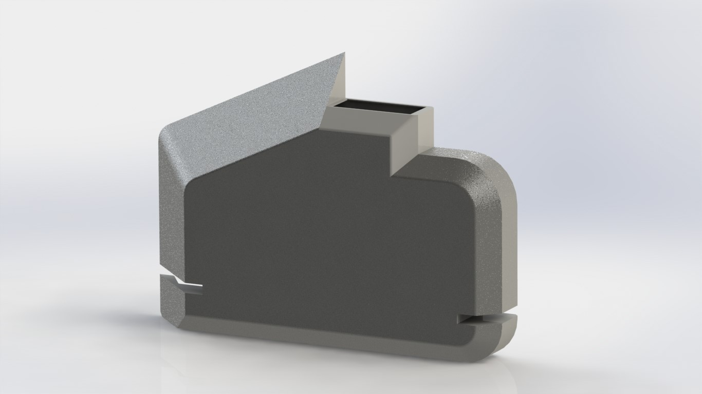

=== Part 5 bin opening

The bin opening part is made to have access at the front of the robot. 

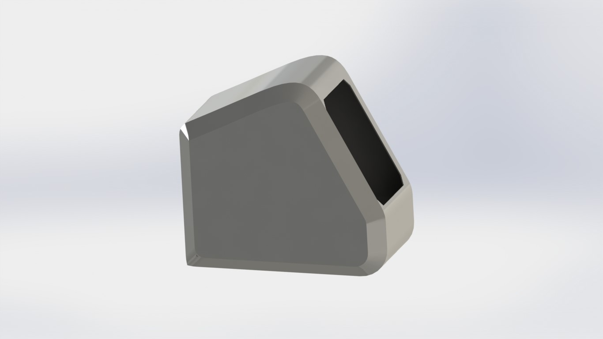

=== Part 6 speaker grill

The speaker grill is a part that protects the speaker from most of the larger items like rocks, cans and bottles. Besides that it protects the vulnerable speaker material from peoples’ fingers.

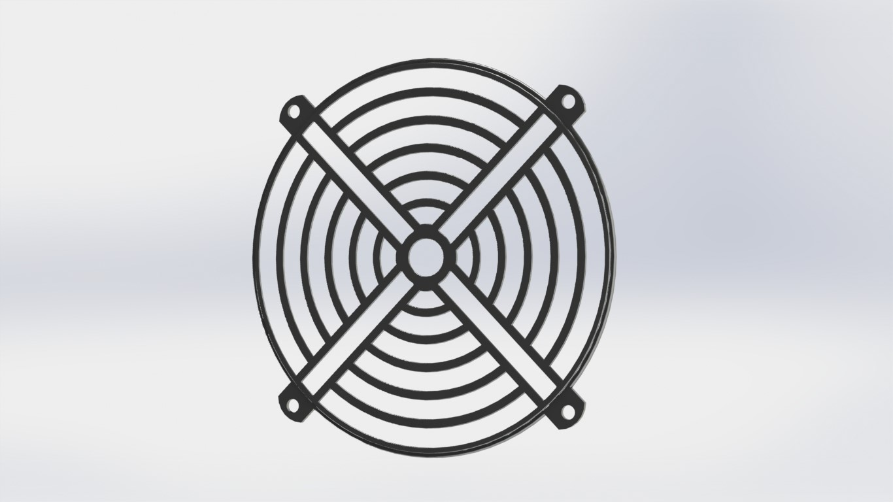

=== Assembly 1 computer housing

This is a example of how the housing of the computer could be made. The brackets fit between the frame and the holes provide the computer with a cooler airflow.

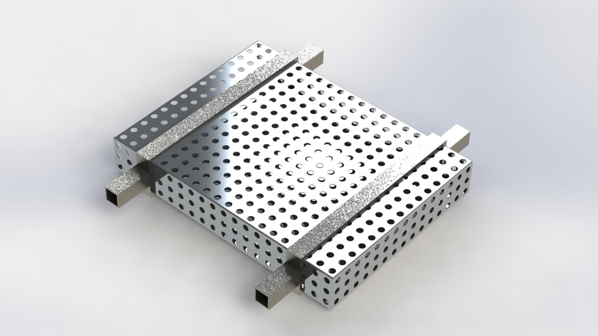

=== Assembly 2 fan

These fans are standard 140mm case fans which suck up air at the bottom rear of the robot while at the top they blow the hotter air back out.

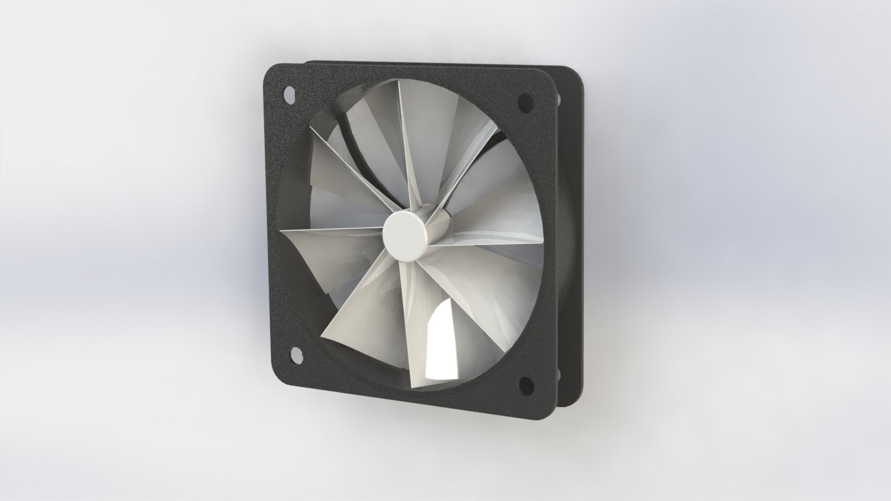

=== Assembly 3 frame

The frame is a part that provides the whole robot with a certain firmness. Parts like the batteries and the outer housing are fixed on the frame. The frame is in that case fixed on top of the wheelchair.
The frame is made out of 25x25mm square steel tubes with a thickness of 1.5mm. The tubes are welded in place.

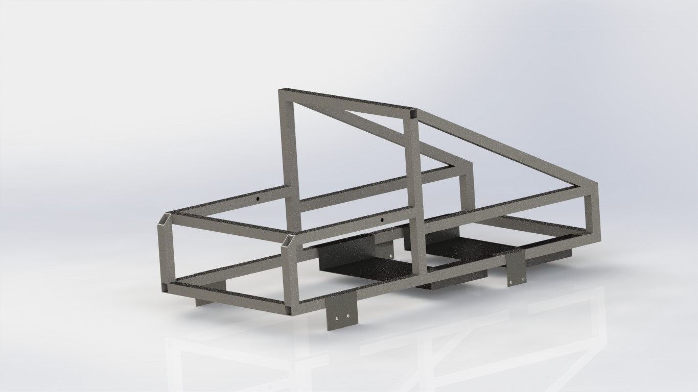

=== Assembly 4 front bumper

The front bumper contains six ultrasonic sensors for a wide view. It also has two sensors aimed to the ground. With these sensors things like a sidewalk or potholes can be detected.

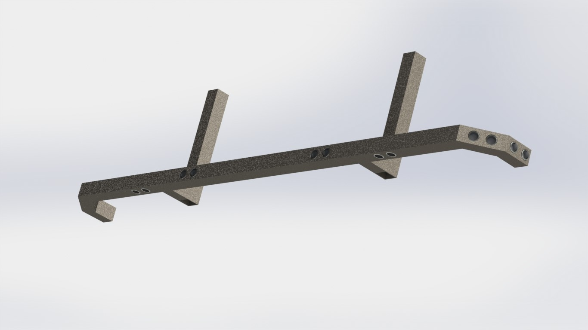

=== Assembly 5 rear bumper

The rear bumper also has six sensors placed outwards and two aimed at the ground. With the front and rear bumper combined there is an almost full 360 degrees view around the robot.

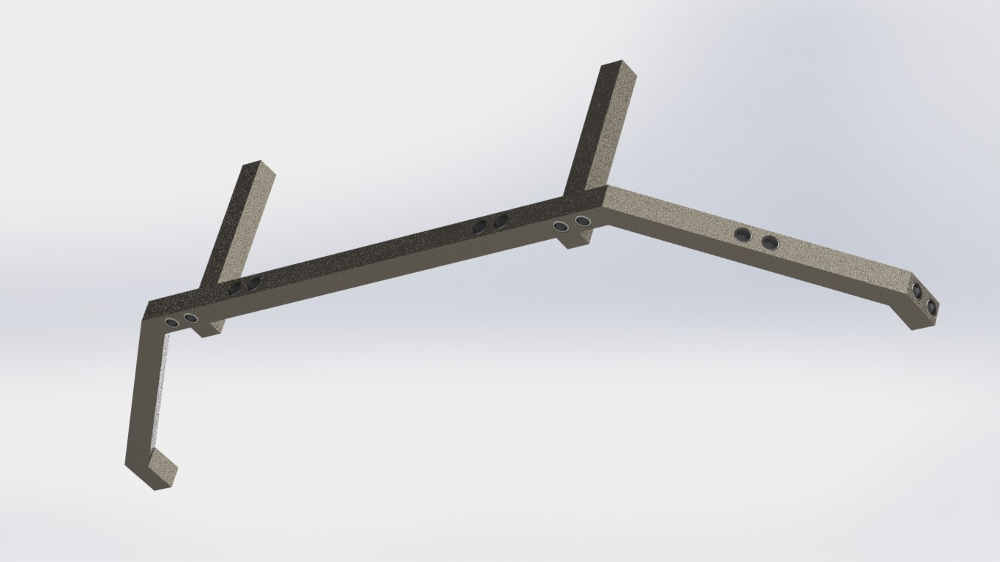

=== Assembly 6 wheelchair

The wheelchair assembly contains the motors and wheels combined with a frame that holds these parts fixed together. This is the base of Willy at the current state.

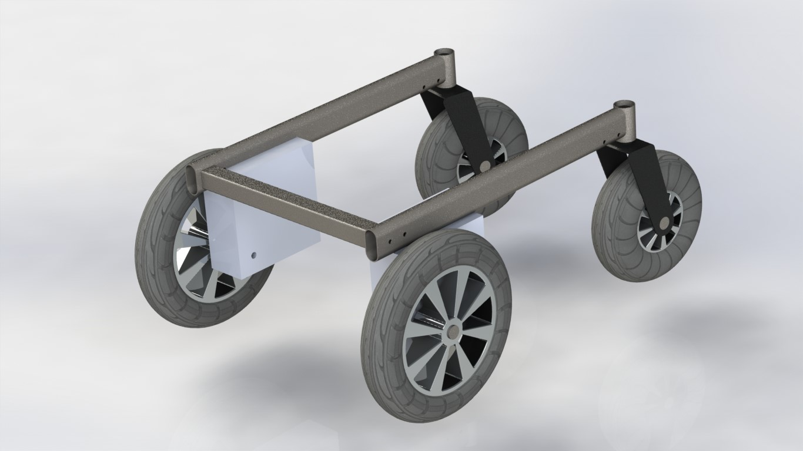

== Design choices
=== Parts design choices
=== Assembly design choices
