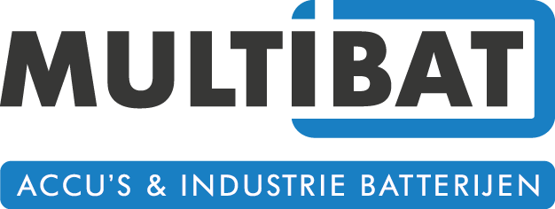
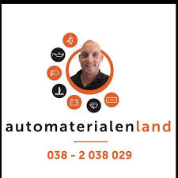
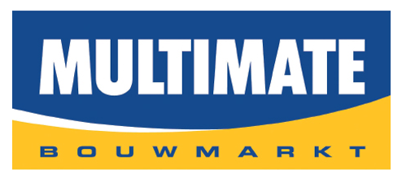

include::../Header.adoc[]

== Sponsors
This document contains a list of all the companies sponsoring Willy.

=== Sick
Sick provided the project with a very expensive LIDAR sensor. Sick 
provided this in cooperation with our product owner.

image:media/sick.png[image,width=300]

=== Multibat
The battery company Multibat showed via our product owner interest 
in our project. After a conversation with the company they proposed 
a deal. Multibat now provides six batteries to us.

=== Automaterialenland
When the batteries were sponsored by Multibat, there were unfortunately 
no cables to connect the batteries. Then we got Automaterialenland as 
contact to provide free cables.

=== Koers Polyestertechniek
Our product owner found a company for us to create the outer plating 
with. After creating a foam mold, we drove it to Koers in Nieuwleusen 
and made the outer skin of Willy from fiberglass.

image:media/koers.jpg[image,width=300]

=== Multimate Vollenhove
Multimate provided the project with building materials and small accessories.

