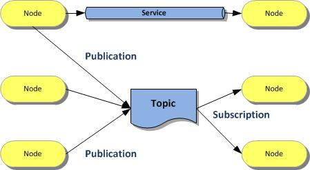

include::../Header.adoc[]

== ROS generic

The Robot Operating System (ROS) is a flexible framework for writing robot software. 
It is a collection of tools, libraries, and conventions that aim to simplify the task of 
creating complex and robust robot behavior across a wide variety of robotic platforms.

Why? Because creating truly robust, general-purpose robot software is hard. 
From the robot's perspective, 
problems that seem trivial to humans often vary wildly between instances of tasks and environments. 
Dealing with these variations is so hard that no single individual, laboratory, or institution can hope to do it on their own.

As a result, ROS was built from the ground up to encourage collaborative robotics software development. 
For example, one laboratory might have experts in mapping indoor environments, 
and could contribute a world-class system for producing maps. Another group might have experts at using maps to navigate, 
and yet another group might have discovered a computer vision approach that works well for recognizing small objects in clutter. 
ROS was designed specifically for groups like these to collaborate and build upon each other's work, as is described throughout this site.

