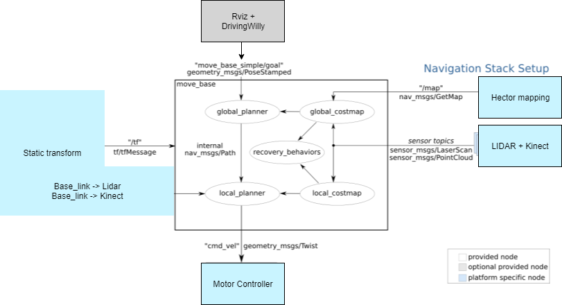
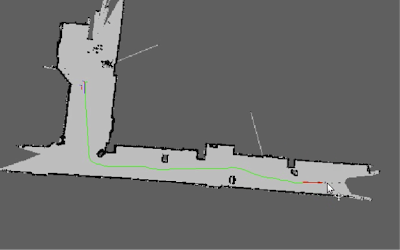

include::../Header.adoc[]

== ROS navigation

Willy uses the ROS navigation stack to navigate inside. The ROS navigation stack is a complex collection of multiple ROS packages.
These packages reads the sensor data we provided from our sensors to create a map of the environment. 
When the user provides a goal from rviz, the global planner will provide a path to that goal and calculate the costs in that map.
costs can be compared with obstacles. The bigger the obstacle, the higher the cost.

In the image above you can see the overview of the ROS navigation stack in our project. We use the move_base from ros.
We send goals from rviz or C++ to the move_base. The move_base converts the goal into a path and calculate a route.
This proces is shown below.

When the path and costs are calculated, the move_base will send geometry::Twist messages to the mobile base.
In our case this is the motorcontroller with the cmd_vel topic. 
When the motorcontroller received a geometry::Twist message. The motor will go driving on the given X, Y and Z velocity from the Twist message.

The ROS navigation stack has a lot of parameters. These parameters change the way the path is calculated and the maximum speed etc. 
For more information about these parameters see:

NOTE: https://artofrobotics.github.io/WillyWiki/Willy/Parameters.html