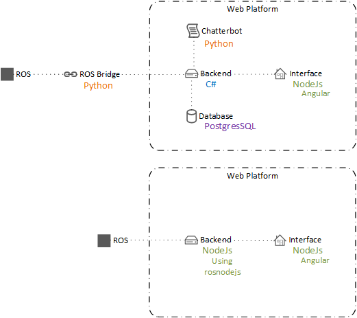

=== Inventorisement Current status

[discrete]
==== Version history

[cols=",,,",options="header",]
|=======================================================================
|Version |Date |Person |Note
|V0.1 |04-02-18 |Martijn van Olst |Initial document

|V0.2 |19-02-18 |Gerard Zeeman |Translated to English

|V0.3 |20-02-18 |Jonathan ten Hove |Removed Dutch, added sources,
checked

|V0.4 |Unknown |Martijn van Olst |Added advantages and disadvantages

|V0.5 |Unknown |Martijn van Olst |Added findings & To Do

|V0.6 |12-03-18 |Martijn van Olst |Updated findings & To Do

|V0.7 |12-03-18 |Gerard Zeeman |Updated schematics

|V0.8 |12-03-18 |Vincent van Dijk |Added Linux packages mapping

|V0.9 |13-03-18 |Martijn van Olst |Added brake functionality

|V1.0 |15-03-18 |Jonathan ten Hove |Added Web Platform
|=======================================================================

==== Preface

_________________________________________________________________________________________________________________________________________________________________________________________________________________________________________________________________________________________________________________________________________________
This document contains a description of the current state of Willy, when
it was transferred by the previous group. This document also contains a
list of advantages and disadvantages of the state at the moment and a
list of recommendations from our side concerning alternative
adjustments. Hardware schematics are found in the appendixes.
_________________________________________________________________________________________________________________________________________________________________________________________________________________________________________________________________________________________________________________________________________________

==== Inventories Willy

We made a summary of findings and summary

==== Findings

1.  Cables are not reliable
2.  Brake function of engines unknown
3.  Realization of frame is not equal to the design
4.  Chatbot documentation is not available
5.  Computers becomes too hot
6.  Computers cannot be rebuilt from scratch
7.  There is no backup and backup procedure
8.  Startup guide is not up to date
9.  ROS framework is outdated
10. Accespoint not necessarily
11. Power usage too high
12. Battery capacity too low
13. Startup problems
14. Frame is not attached properly
15. Passwords are inconsistent
16. Web interface unreliable
17. Autonomous driving not working
18. Steering is too sensitive

==== To Do

1.  Renew cables and manage cables
2.  Research operation of brakes
3.  Research design and placing of parts
4.  Research social interaction
5.  Add a way to cool the computer
6.  Mapping of Linux packages
7.  Research backup & creating a backup
8.  Make startup guide up to date
9.  Research possibilities of updating ROS framework
10. Setup internal Wi-Fi hotspot
11. Reduce power usage
12. Increase battery capacity
13. Increase usability
14. Attach frame correctly
15. Make passwords unambiguous
16. Make web interface reliable
17. Research autonomous driving
18. Reduce sensitivity of steering

==== Inventories of sensors

==== Findings

1.  Documentation not fully completed
2.  Sensitive to malfunction
3.  Mounting sensors
4.  Inaccurate GPS data
5.  Inaccurate Compass data
6.  Wheel encoders aren’t working
7.  Microphone not present

==== To Do

1.  Create schematics of hardware layout
2.  Replace cables
3.  Remount sensors
4.  Remount GPS sensor
5.  Remount Compass sensor
6.  Remount wheel encoders or research alternatives
7.  Buy microphone

==== Motor encoder

Willy is driven with 2 scooter motors. The turning of the wheels are
measured with wheel encoders. These encoders measure the number of steps
the motors have turned and send this data to the motor controller, which
processes this data.

image:media/current-status/image2.jpeg[image,width=163,height=96]

The need of the current motor encoders is optional. At the moment of
writing, the motor encoders aren’t working at all. The reason why these
motor encoders are chosen is to measure the distance and speed of the
motors. By combining this data with the sonars, willy will be able to
avoid obstacles inside. Because of the fact that these encoders aren’t
working we have to do some research to alternatives.

It is unknown why this controller is chosen. However previous
documentation does mention the exact model in use. (System overview
V1.0, 2017) (Systeem Dossier, 2016)

*Honywell Clarostat 600-128-CBL. Specs sheet*

[cols=",",options="header",]
|=======================================================================
|Product |Product
|600-128-CBL |600-128-CBL

|Encoder Type |Encoder Type

|Optical |Optical

|Pulse Per Revolution |128

|Output |2-square wave, Channel A leads Channel B by 90° electrically in
counterclockwise direction

|Output Voltage |2.4 Vdc min. (high); 0.4 Vdc max. (low)

|Operating Temperature |-40 °C to 65 °C [-40 °F to 149 °F]

|Storage Temperatue |-55 °C to 110 °C [-67 °F to 230 °F]

|Rotational Life |10 Million shaft rotations, min.

|Operating Speed |Operating Temperature

|Terminal |Cable with four-lead ribbon, 28 AWG, IL-W-168780 Type B or
equivalent insulation

|Source voltage range |5 Vdc ±5% at 30 mA max. plus external
requirements

|Supply Current |30 mA
|=======================================================================

image:media/current-status/image3.jpeg[image,width=155,height=116]Motor controller

Willy contains 2 motors from a second-hand scooter. A previous project
group has chosen this option as documented in the ‘Ontwerp verslag’.
(Ontwerpverslag, 2016)

These motors need 24 volts and use 20 amps. One of the previous project
groups created the motor controller to control the motors. This is
documented in the ‘Systeem dossier’ from a previous project group.
(Systeem Dossier,
2016)image:media/current-status/image4.jpeg[image,width=112,height=149]

This motor controller is made by using an Arduino Mega and a custom
shield with additional custom hardware. This hardware makes sure the
data from the wheel encoders are sent to the proper digital pins on the
Arduino board. The motor controller processes the data and sends it to
the ROS framework. This data is then processed by the WillyController,
which is running as a node on the ROS framework.

The current to the motors is also controlled by this Arduino.

The motor controller is built as shown below:

image:media/current-status/image5.jpg[image,width=604,height=427]

[[_Toc508714671]]

==== Motor brake functionality

The two engines of willy contain both a brake. This brake is controlled
by the engine itself. When the active signal to the motors is lost, the
motor will automatically activate the brake. To start the driving_willy
project, you NEED to deploy the brakes. Otherwise Willy will not drive!

image:media/current-status/image6.jpeg[image,width=268,height=358]image:media/current-status/image7.png[image,width=269,height=359]

Make sure to deploy the brakes. Otherwise Willy won’t work!! There is
only one way to detect if the brakes are deployed. It’s by simply
testing if the wheel can turn (Or a very little bit) anymore.

==== Ultrasonic sensors

To prevent collisions, ultrasonic sensors are used. These sensors
measure distance by using sound. This is made possible by sending out
bursts of high frequency noise, and then waiting for a reflection of
that sound.image:media/current-status/image8.jpeg[image,width=208,height=117]

By using this data Willy is be able to decide if he is able to drive any
further in a certain direction. In the event of Willy being not able to
drive any further, he will decide if there is a direction where he is
able to drive further. This way Willy will be able to drive around
autonomously without collisions. How Willy reacts to objects in his
navigation is researched by a previous group. (Navigation design v0.1,
2017)

The sensors all use 5V as can be seen in the schematic:

image:media/current-status/image9.jpg[image,width=604,height=427]

As shown in the schematic above, all the 16 sensors are connected to the
Arduino.

The sensors are connected in the following order:

[cols=",",options="header",]
|===============================================
|Arduino Digital Pin Number |Sonar Sensor Number
|3 |Sensor 0
|4 |Sensor 1
|5 |Sensor 2
|6 |Sensor 3
|7 |Sensor 4
|8 |Sensor 5
|9 |Sensor 6
|10 |Sensor 7
|11 |Sensor 8
|12 |Sensor 9
|13 |Sensor 10
|A0 |Sensor 11
|A1 |Sensor 12
|A2 |Sensor 13
|A3 |Sensor 14
|A4 |Sensor 15
|===============================================

The sensors are placed as follows:

image:media/current-status/image10_3.jpg[image,width=339,height=476]

It should be noted that not all the sensor are read at the same time. 
All odd numbered sensors are read first, and after a small delay the 
even numbered sensors are read. This is because sensors placed next to
each other can interfere the readings of each other.

1.  image:media/current-status/image11.png[image,width=266,height=92]Kinect sensor

As a method to navigate inside, the Kinect was chosen. A Kinect can
create a framework of a person and see all movements of that person. By
adding a Kinect to willy, willy will be able to recognize people and
interact with them by using the speech recognition of the Kinect.

There are two versions of the Microsoft Kinect: Kinect 1 for Xbox 360
and Kinect 2 for Xbox one. See table 1 which list all the different
features of both versions.

[cols=",,",options="header",]
|======================================================
|Feature |Kinect 1 |Kinect 2
|Color Camera |640 x 480 @30 fps |1920 x 1080 @30 fps
|Depth Camera |320 x 240 |512 x 424
|Max Depth Distance |~4.5 M |8 M
|Min Depth Distance |40 cm in near mode |50 cm
|Depth Horizontal Field of View |57 degrees |70 degrees
|Depth Vertical Field of View |43 degrees |60 degrees
|Tilt Motor |Yes |no
|Skeleton Joints Defined |20 joints |25 joints
|Full Skeletons Tracked |2 |6
|USB Standard |2.0 |3.0
|======================================================

The main difference which is most important for us is the Field of View
(FoV). The bigger the FoV, the more Willy can see in front of him. The
Kinect 2 can also recognize more people and can see further away, which
are both nice features to have when the social aspect of Willy will be
implemented in the future. This makes the Kinect 2 more futureproof than
its precursor. (Kinect 1 vs 2 specifications: , sd) (Kinect 1
specifications, sd) (Main factors/features of most industrial computer
vision hardware., sd)

==== GPS & Compass sensor

To allow Willy to drive outdoor by using a precomputed route, a GPS
sensor and a compass are required. The GPS sensor is linked to the
WillyController using ROS. In WillyController the raw data is processed
to usable coordinates. These coordinates are only used to draw a line
where Willy has driven in the code of the previous group. +
The Compass is used to determinate the direction of willy. This is
needed for navigation when willy is going to drive precomputed routes.

The sensors are connected according to the following scheme:

image:media/current-status/image12.jpg[image,width=604,height=427]

As can be seen in the scheme, there are two Arduino’s used to measure
sensor data. Both Arduino’s are connected with I2C (see pins A4 and A5).
The second Arduino with the GPS sensor is powered with the 5V pin from
the first Arduino. At the moment of writing this has not been fixed and
reduced to one Arduino.

==== LIDAR sensor

The previous group has also done research on a Lidar sensor.
Unfortunately the previous documentation stated that it was not possible
to link a Lidar to ROS. Also other methods where somehow researched by a
previous group but not in the form of a Lidar. (Research localization
system v1.1, 2017)

A LIDAR sensor uses a laser to measure distance. With these measurements
the sensor makes a map of all the objects in the environment.

image:media/current-status/image13.jpeg[image,width=130,height=174]The current state of
Willy has no LIDAR installed. The previous group has done some research
concerning LIDAR and the link to ROS. But came to the conclusion that it
is not possible to create a link between LIDAR and ROS. Therefore they
decided to not implement the LIDAR sensor.

After doing some research we found that it is possible and supported to
link ROS to a LIDAR sensor.

==== Avantages & Disadvantages

[cols=",,",options="header",]
|====================================================================
|Items |Advantages |Disadvantages
|Motor encoder a|
1.  Cheap

 a|
1.  Inaccurate
2.  Quality of brackets

|Motor controller a|
1.  One controller for all motor
2.  communications

 a|
1.  No clear overview

|Ultrasonic sensor a|
1.  Fast
2.  Accurate measuring of distance
3.  Cheap
4.  Wide range
5.  Easy to mount

 a|
1.  Temperature (does not work if temperature is around zero degrees)
2.  Control of big amounts of sensors will become complicated

|Kinect sensor a|
1.  Precision face cam
2.  Good microphone

 a|
1.  Little possibility to determine the position in the room
2.  Can be complicated to implement

|GPS & Compass sensor a|
1.  GPS is a good method for determining the outdoor position
2.  Compass is fast

 a|
1.  GPS is slow with finding satellites
2.  Data can be inaccurate

|LIDAR sensor a|
1.  Accurate way to scan the environment

 a|
1.  Can be complicated to implement

|Mini PC a|
1.  Central place to run ROS with Willy code and web platform

 a|
1.  Sensitive to malfunctions (e.g. overheating, moisture)

|====================================================================

==== Operation system of Willy

Currently, Willy is operating using ‘Linux Ubuntu 14.04’ as operation
system. The ROS-framework is used for centralized communication between
nodes. Nodes are referred as different software/hardware components of
‘Willy, think of; GPS, sensors, compass and software functions. Some
nodes may require ‘dependent-ROS-packages’. To execute and compile
software nodes, these packages are required. Both ROS and dependencies
require the same version. The current version of ROS is ‘ROS-kinetic’,
the newest version is ‘ROS-Lunar’. Both ROS, ROS-dependencies and Ubuntu
must be updated. Afterwards the code can be tested and compiled in the
new environment.

==== Current installed packages

The first step in updating the OS is to determine which packages and
dependencies are installed. Because previous teams have made a lot of
changes to ‘Willy’, not all Linux packages may be still required. To
list the manual installed packages, the following command was used.

_comm -23 <(apt-mark showmanual | sort -u) <(gzip -dc
/var/log/installer/initial-status.gz | sed -n 's/^Package: //p' | sort
-u)_

The following packages where manually installed;

[source,text]
----
brightness-controller
dhcpcd5
dotnet-sdk-2.0.0
git
google-chrome-stable
htop
nmap
openssh-server
pgadmin3
postgresql
python-pip
*ros-kinetic-desktop-full*
*ros-kinetic-joystick-drivers*
*ros-kinetic-rosbridge-server*
*ros-kinetic-rosserial-python*
*ros-kinetic-rosserial-server*
*ros-kinetic-teleop-twist-joy*
*ros-kinetic-teleop-twist-keyboard*
*ros-lunar-catkin*
*screen*
vsftpd
x11vnc
xfce4
xrdp
----

Some of the above packages are required to compile and execute the
‘WTGD’ code that is available from GIT, these packages are bold listed.
Other packages may be required for the web platform or may have another
goal than compiling and executing ROS code. In this project there will
be major changes in the web platform, because some of the code will be
changed, dependencies will be determined during the development of the
code. Other packages are explained in documentation that will be
available with the final delivery.

==== Determined packages for Ubuntu 16.04 and ROS-Lunar

To create a clear view about the current ‘WTGD’ code that ‘Willy’
contains, and how this works on Ubuntu 16.04 with ROS-Lunar, a test
environment was created. None of the previous listed packages where
installed, only Ubuntu 16.04 was installed and the ROS-framework on top
of this. The code was not able to build successful in this test
environment, however based on the error messages, dependencies where
determined. Every time a decency was missing, the error massage was
inspected. We concluded that the following packages are required to
execute the ‘WTGD’ code on Willy.

[source,text]
----
ROS-lunar-desktop-full
Screen
ROS-lunar-rosserial
ROS-lunar-rosserial-arduino
ROS-lunar-rosapi
ROS-lunar-rosbridge-server
----

==== Install dependencies

To install above dependencies, the following commands are required.

Install Ross

[source,shell]
----
sudo sh -c 'echo "deb http://packages.ros.org/ros/ubuntu $(lsb_release
-sc) main" > /etc/apt/sources.list.d/ros-latest.list'
----

[source,shell]
----
sudo apt-key adv --keyserver hkp://ha.pool.sks-keyservers.net:80
--recv-key 421C365BD9FF1F717815A3895523BAEEB01FA116
----

[source,shell]
----
sudo apt-get update
sudo apt-get install -y ros-lunar-desktop-full
sudo rosdep init
rosdep update
----

Link the ros framework to the ubuntu bash 

[source,shell]
----
echo "source /opt/ros/lunar/setup.bash" >> ~/.bashrc
source ~/.bashrc
----

Start a new bash prompt and run (test)

[source,shell]
----
roscore
----

Install ROS-dependencies

[source, shell]
----
sudo apt-get install Screen
sudo apt-get install ros-kinetic-rosserial
sudo apt-get install ros-kinetic-rosserial-arduino
sudo apt-get install ros-kinetic-rosapi
sudo apt-get install ros-kinetic-rosbridge-server
----

Give user permission to access USB ports

[source,shell]
----
sudo usermod -a -G dialout willy
----

With the above installation changes made to Ubuntu, the current ‘WTGD’
code was able to run. Packages listed in the 11.1. can be used as
reference material.

==== Web Platform

The current status of the web platform uses various components to
achieve a platform on which you can remotely control Willy and retrieve
its status.

Current configuration

A global overview of how the platform is configured is as following:

==== Ros Bridge

Ros bridge is a platform between ROS and another application such as a
web interface. The bridge is written in Python and translates serial
packages to json for more universal use in external applications such as
the web platform. The deserialization of ros messages does take some
time to process. (ROS rosbrigde, 2017)

==== Backend

The backend of the current web platform is written in C# and uses
ASP.NET as a framework and SignalR as API. It is unclear why there has
been chosen to use C# for this, especially since the frontend isn’t
ASP.NET as well. Which would make more sense because classes and models
can be reused. The documentation does state that SignalR is used because
it is able to send updates form the server to the client via websockets
but this can also be achieved using other tools, see interface. Bron
toevoegen technisch ontwerp We also found that this choice might have
been made because of the present knowledge and experience with SignalR.

Because ASP.NET is only used for the backend all messages from and to
the ros bridge are first translated to C# objects using the defined
classes in the application and then translated back to JSON for API
usage. This is another extra step that adds to latency between Willy and
the web platform. Below shows a visual of all the conversions done.

image:media/current-status/image16.png[image]

Here you can clearly see the different conversions done to ROS messages,
this is further explained in advised configuration. For example if
ASP.NET was also used in the inferface (front-end) then past the serial
to JSON conversion it would only be C# objects, but in the current
situation this is again translated back to JSON because the front-end is
written in NodeJS (JavaScript)

==== Chatterbot

Chatterbot is currently used as a tool for social interaction but is
limited in its abilities. We found that this choice was only based on
the ease of use. However this does add another layer of complexity to
the whole web platform because it’s written in another language then all
of the other components. As a side note, integrating a complete social
interaction was not the goal of the previous groups and thus need
further research.

==== Database

The database used is PostgreSQL, while this is a reliable and mature
database system and targeted on it is quite heavy to run and the main
target audience are corporate businesses. So for the Willy project it is
quite overdone to have such a system running especially when the only
things saved are some commands and a few login credentials.

==== Interface

Willy’s visible part of the web platform is written in NodeJs and uses
various bower and gulp components and as a framework AngularJs. This is
an easy to setup configuration and gives developers the ease of fast web
development.

==== Advantages/Disadvantages

===== Advantages
* Seperate modules
* Learning multiple languages and techniques
* Based on official ROS Bridge
* C# is a language which is used across Windesheim
* Scaleable database

===== Disadvantages
* Complex
* Custom hooks to tangle it all together
* Serialising and Deserialising takes a lot of time
* Slow due to translation in different object orientated languages 
* No reusage of classes/objects

==== Advised configuration

During research we found that a platform for ROS exist using NodeJS, using this it is possible to directly communicate with ROS and at the same time host a web platform using the same code. An overview of this would look like the following visualisation.

==== Backend
The backend can then use NodeJS and socket.IO for api calls. 

image:media/current-status/image17.png[image]

==== Interface
The interface can be reused because it is also written in NodeJS

==== References

- _Kinect 1 specifications_. (sd). Opgehaald van
https://msdn.microsoft.com/en-us/library/jj131033.aspx__Kinect 1 vs 2
- specifications:__ . (sd). Opgehaald van
http://www.imaginativeuniversal.com/blog/2014/03/05/Quick-Reference-Kinect-1-vs-Kinect-2/_Kinect_.
- (2017, December 21). Opgehaald van Wikipedia:
https://nl.wikipedia.org/wiki/Kinect__Main factors/features of most
- industrial computer vision hardware.__ (sd). Opgehaald van
http://robotics.stackexchange.com/questions/7014/what-main-factors-features-explain-the-high-price-of-most-industrial-computer-viNavigation
- design v0.1, Research (2017).Ontwerpverslag (2016).Research localization
- system v1.1, Research (2017)._ROS_. (2018, Januari 1). Opgehaald van
ROS: http://wiki.ros.org/sick_timSysteem Dossier (2016).System overview
- V1.0, Hardware overview (2017)._Wikipedia_. (2017, November 7).
Opgehaald van Wikipedia: https://nl.wikipedia.org/wiki/Lidar
