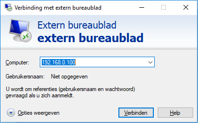
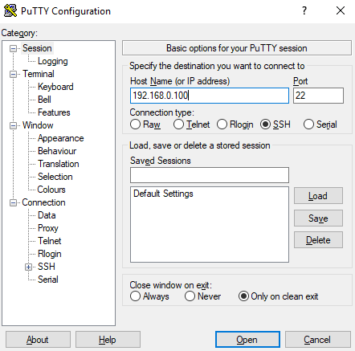

include::../Header.adoc[]

IMPORTANT: This page is deprecated and will be removed in the future.

== Remote
=== Setup Wifi connection
Before any form of connection can be realized, a wireless connection is required. When the power switch is turned on, the router will setup a wifi access point. Connection with the access point can be set with the following data.

SSID:   Willy  
WPA2-password:  See password file.

=== Remote Desktop connection
If a wifi connection is established. A RDP connection can be realized. The following working method applies to a Windows environment.

Start -> Run -> MSTSC -> 192.168.0.100 0 -> Connect

Local login credentials can be used when logging in.

=== SSH
If a wifi connection is established. An SSH connection can be realized. SSH can be setup through a SSH client such as 'Putty'. The default port 22 is required with the IP of '192.168.0.100'. See the screenshot below for details.

Local login credentials can be used when logging in.

