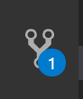
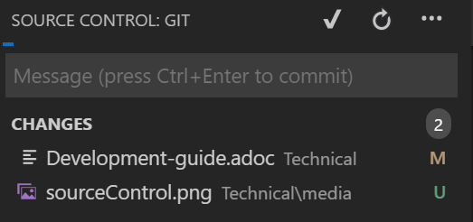

include::../Header.adoc[]

== Development Guide

=== Prerequisite 

To be able to develop Willy there are a few Prerequisites: +

- Computer +
- Visual Studio Code +
- Internet connection +
- Basic knowledge about C++ and C +
- Basic knowledge about ROS +
- GIT +

*Computer* +
A computer is required as medium to program and write code. +
Without a computer and the software below, you cannont program Willy. +

*Visual Studio Code* +
Visual Studio Code is a Integrated Development Environment. This program is used +
to write code and use git to send the documents to Willy. Visual studio can be +
extended with a lot of extensions. These extensions make it possible to align +
the code and see if the syntax of your code is correct or incorrect. +

*Internet connection* +
To make sure Willy get the code updates and git is working properly, a working  +
internet connection is required. +

*GIT* +
GIT is used as file transfer and version manager of the current Willy project. +
Everything starts with setting up the GIT repository and be able to push and pull + 
parts of code. That makes GIT essential in the Willy development. +

*Basic knowledge about {cpp} and C* +
The Willy code is written in C++. To add features and understand the code, some basic +
knowledge of {cpp} is required. If you want to learn the basics of {cpp}? Follow a semester + 
programming or see the following tutorial +

NOTE: https://www.studytonight.com/cpp/introduction-to-cpp.php

*Basic knowledge about ROS* +
Because Willy is based on the Robot Operating System (ROS), a basic knowledge of ROS +
is required to communicate with the different modulair parts of Willy. ROS learing +
may be difficult, but you can follow the following tutorial to learn the basics: +

NOTE: http://wiki.ros.org/ROS/Tutorials 

=== Development

NOTE: To start development, make sure you complies to the requirements above.

1. Make a folder on your local computer where you want the Willy project to take place. +
2. Install git. +
NOTE: Git can be downloaded from the following website: https://git-scm.com/downloads
2. Clone the WTGD git repository. +
    This can be done with the following command: +
        `*git clone https://github.com/ArtOfRobotics/WTGD*` +
3. Checkout at the `test` branch. +
    This can be done with the following command: +
        `*git checkout test*` +
4. Open Visual Studio Code and open the cloned WTGD folder. +
    This can be done by following this steps: +
        *File* -> *Open Folder* -> *Navigate to WTGD folder* -> *Select Folder* +
5. In the navigation window on the left, navigate to: +
    *willy* -> *src* +

NOTE: In this folder all the Willy ROS packages are listed. 

*With the following steps some changes to the DrivingController will be made.*

1. Open the DrivingWilly package by navigating to the `driving_willy` folder in the navigation bar. +

2. Navigate to the DrivingController by following this steps: +
    *src* -> *Controllers* -> *DrivingController.cpp* +

3. Do some stuff with the controllers and subcontrollers as described in the software wiki page. +

NOTE: https://artofrobotics.github.io/WillyWiki/Technical/Software.html 

4. Commit your changes to the git repository. By using visual studio, navigate to the source control on the left: +

Add a commit message in the message field above and press check. +

=== Compilation

=== Testing/Debugging