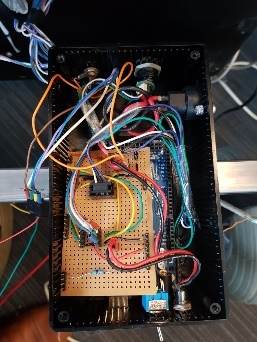
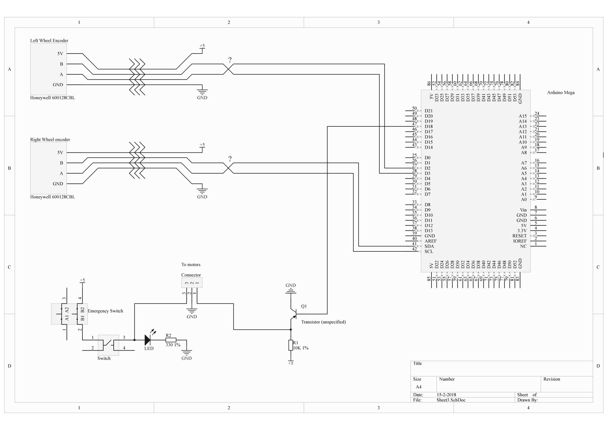
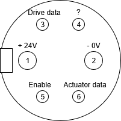
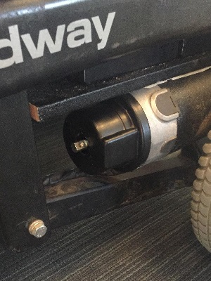
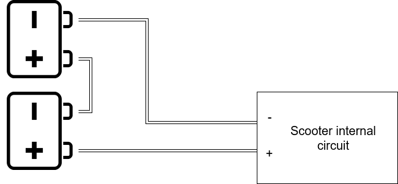
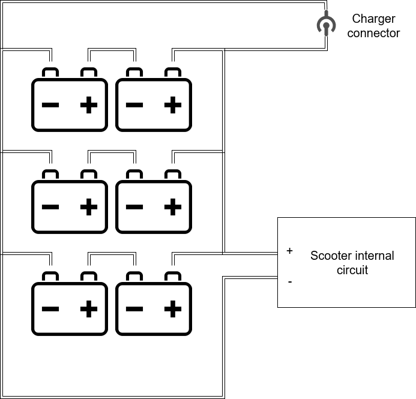
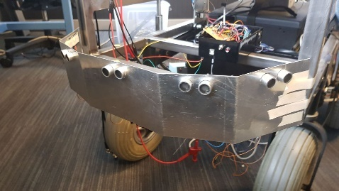
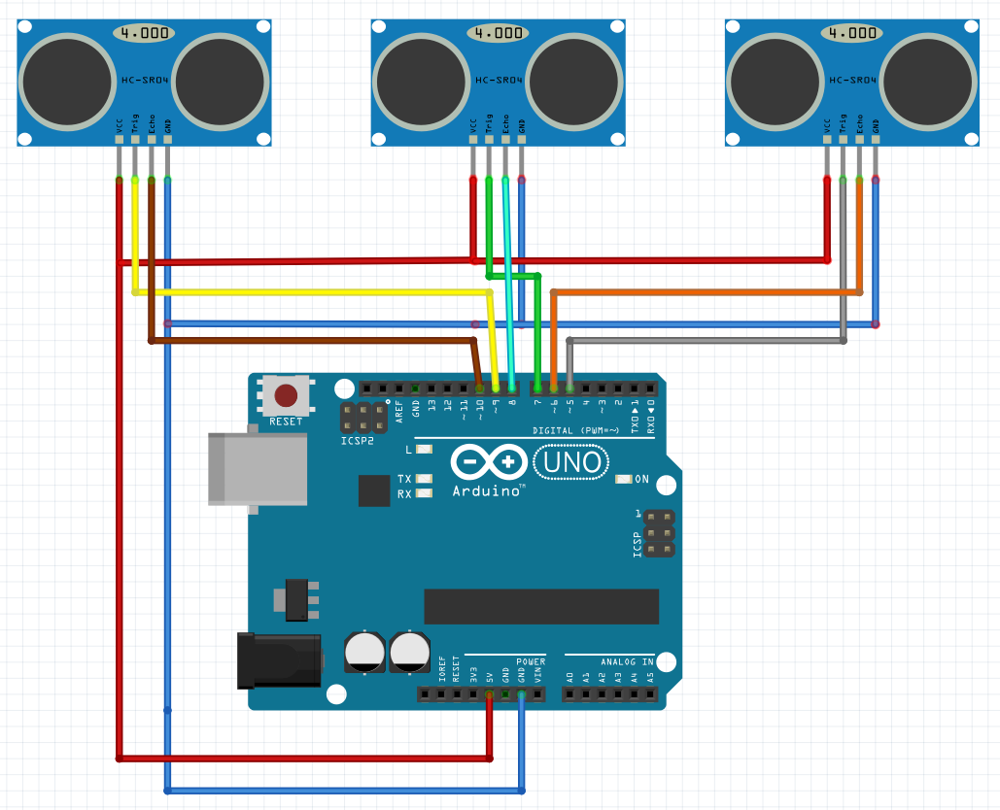

include::../Header.adoc[]

== Hardware

=== Overview
A simple overview of all the hardware in Willy is made in the 
following scheme:

image:media/technical/Connections.png[image]

=== Components
This chapter contains all the components with explanation.

==== Laptop
This is the dedicated computer for running the ROS Server. Al the calculational 
work will be done on this laptop. Therefore, we chose for a computer with some 
calculation power as well as enough RAM.

[cols=",",options="header",]
|===============================================
|Product |Fujitsu Lifebook E752
|CPU |Intel Core I5 3210M 2.5GHz dual-core
|Video Chip |Intel HD Graphics
|RAM |16 GB DDR3L Sodimm
|Harddisk |Western Digital Black 500GB 2,5" HDD
|Amount of USB Ports 
a|
- 1x USB3.0
- 1x USB3.0 / eSATA
- 4x USB2.0
|Other Ports 
a|
- 1x VGA
- 1x DisplayPort
- 1x 1GB/s Network Port
- 1x RS232
- 1x Microphone Jack
- 1x Headphone Jack
- 1x PCMCIA
- 1x SD Cardreader
|Wireless Connection options |WLAN chip
|===============================================

==== Motors and controller
Willy contains 2 motors from a second-hand mobility scooter. A previous 
project group has chosen this option as documented in the ‘Ontwerp verslag’.
(Ontwerpverslag, 2016)

These motors need 24 volts and use a max of 20 amps. One of the previous project
groups created the motor controller to control the motors. This is
documented in the ‘Systeem dossier’ from a previous project group.
(Systeem Dossier, 2016)

This motor controller is made by using an Arduino Mega and a custom
shield with additional custom hardware. The controller recieves data from ROS 
and sends it to an internal controller. This is part of the wheelchair and 
is named Penny and Giles Pilot Plus.

The motor controller is built as shown below:

NOTE: As can be seen in the image above, there are still cables for the odometry 
sensors. These are however not used anymore. This has two reasons. The first 
one is the fact that since using the lidar, the positioning is so accurate, 
that the wheel encoders are not neccesary anymore. The second reason is that both the sensors don't function anymore.

The 3 cables to the internal motor controller (built in in the wheelchair 
frame) are connected to the original cable with a simple circuit. The pinout 
of the connector attached to the cable is as follows:

[cols=",,",options="header",]
|===============================================
|Pin number |Description |Internal Cable Color
|1 |{plus} 24V | Red 
|2 |- 0V | Black
|3 |Driving data |White
|4 |Unknown (not used) |Yellow
|5 |Enable | Blue
|6 |Actuator Data (not used) |Green
|===============================================

The drive data pin (3) is used to send driving commands to the internal 
controller. The yellow cable is not used and the function is unknown.
The enable pin is connected to the emergency button and the switch on 
the motor controller. The motors only work when the voltage level on this 
cable is 5 volts. The actuator pin is not used in this project. In the 
original wheelchair this pin is used for the lighting etc.

NOTE: The motor controller also contains a connection for charging the 
batteries. The connector at the side of the box is connected to the {plus} 
and - of the cable to the internal motor controller.

===== Brakes

The two engines of Willy both used to contain a brake. This brake was controlled
by the engine itself. The levers of the brakes are removed, rendering them always active. Before the
removal of the brake levers, it was neccesary to verify wether the brakes were deployed or not.
In order to let Willy move, the brakes had to be deployed. This was orginally a safety feature of the 
mobility scooter, but was not needed any longer.

image:../Archive/2018S1/Research/media/current-status/image6.jpeg[alt=image6,width=300,height=400]

image:../Archive/2018S1/Research/media/current-status/image7.png[alt=image7,width=300,height=400]

Make sure to deploy the brakes. Otherwise Willy won’t work!! There is
only one way to detect if the brakes are deployed. It’s by simply
testing if the wheel can't turn (Or a very little bit) anymore. 

IMPORTANT: The wheels should not be able to turn for Willy to function 
normally. The brakes will automatically be released by Willy when driving.

==== Batteries

===== Old situation
In the old situation Willy contained 2 12V batteries connected in serial,
adding up to 24V. Both batteries are 52Ah.

image:media/technical/battery_old.jpg[image,width=500]

===== New situation
In the new situation the 2 batteries are replaced with 6 new 12V batteries.
All the batteries are 33Ah. They are connected placing 2 batteries in serial
3 times in parallel. This adds again up to 24V.

image:media/technical/battery_new.jpg[image,width=500]

==== Power Supply
The mains from the batteries run through a central fuse box mounted at Willy's 
left hand side. The fusebox contains 4 circuitbreakers powering 4 step down convertors

image:../Archive/2018S1/Research/media/current-status/fusebox.jpg[alt=fusebox,width=400,height=300]

image:../Archive/2018S1/Research/media/current-status/fuseboxcircuitbreakers.jpg[alt=fuseboxcircuitbreakers,width=400,height=300]

The powerleads after the circuit breakers are bundled and routed to a transparant plastic case which
serves as a power distribution unit. The power distribution unit contains 4 step down converters, controlled
by 4 switches toggling power for these converters.

image:../Archive/2018S1/Research/media/current-status/powerconverterbox.jpg[alt=powerconverterbox,width=400,height=300]

The monitor is powered with 19 volts provided from the powerconverter box.
The laptop is powered with 19 volts provided from te powerconverter box.
The fan on top of the powerconverter box is powered with 12 volts, connected internally.
The last powerconverter is set to 5 volts, capable of powering various arduino components if needed.

Al leads are connected to screwterminals at the far side of the powerconverter box.

*ORIGINAL TEXT*
-
The 19 volts for the screen is provided by a step-down converter.
The module is based on the Xl4015 buch DC to DC converter. The input voltage
range is 8-36V and the adjustable output range is 1.25V to 32V. The converter
is rated for a max current of 5 amps.

The mini pc is connected to a small 19.5V DC step-down converter. This is needed
because the screen needs the full amperage of the other 19.5 step-down converter.
The mini pc use 65 Watt and the step-down converter can provide a maximum of 75 watt.

The power for the step-down converters is provided by the batteries. 
Between the batteries and the step-down converter, there is a fuse placed. 
The fuse called T5L250V is rated for 250V with 5A. Then a switch is used to turn Willy
on or off. 
To split the 24v of the batteries to all the step-down converters, there is a homemade pcb plate created.
This board is placed at the left of the step-down converters.
-
*END OF ORIGINAL TEXT*

==== Sonars

To prevent collisions, ultrasonic sensors are used. These sensors
measure distance by using sound. This is made possible by sending out
bursts of high frequency noise, and then waiting for a reflection of
that sound using the HC-SR04 ultrasonic sensor. 

By using this data Willy is be able to decide if he is able to drive any
further in a certain direction. In the event of Willy being not able to
drive any further, he will decide if there is a direction where he is
able to drive further. This way Willy will be able to drive around
autonomously without collisions. How Willy reacts to objects in his
navigation is researched by a previous group. (Navigation design v0.1,
2017)

The datasheet <<1>> for the HC-SR04 is included in the sources at the bottom 
of this document.

The sensors all use 5V as can be seen in the schematic:

As shown in the schematic above, all the 3 sensors are connected to the
Arduino.

The sensors are connected in the following order:

[cols=",",options="header",]
|===============================================
|Arduino Digital Pin Number |Sonar Sensor Number
|5 |Trigger Sensor 0
|6 |Echo Sensor 0
|7 |Trigger Sensor 1
|8 |Echo Sensor 1
|9 |Trigger Sensor 2
|10 |Echo Sensor 2
|===============================================

The sensors are placed as follows:

image:media/technical/Willy.png[image]

It should be noted that not all the sensor are read at the same time. 
The numbers sensors are read in a sequence. Only the lowest value is publisched on the topic.

==== EMU
To allow Willy to have a quick fix in his drive algorithm, we have implemented a EMU. The EMU will help the AMCL algorithm to find his heading.

==== Screen
The screen used is a KDL-42W815B <<2>> from Sony. The screen is connected to 
the mini-pc with a VGA cable. The manual can be found at the bottom of 
this document.

==== LIDAR
The previous group has also done research on a Lidar sensor.
Unfortunately the previous documentation stated that it was not possible
to link a Lidar to ROS. Also other methods where somehow researched by a
previous group but not in the form of a Lidar. (Research localization
system v1.1, 2017)

A LIDAR sensor uses a laser to measure distance. With these measurements
the sensor makes a map of all the objects in the environment.

image:../Archive/2018S1/Research/media/current-status/image13.jpeg[image]

The previous group has done some research concerning LIDAR and the link to 
ROS. But came to the conclusion that it is not possible to create a link 
between LIDAR and ROS. Therefore they decided to not implement the LIDAR 
sensor.

After doing some research we found that it is possible and supported to
link ROS to a LIDAR sensor.

At this stage we use the LIDAR to navigate with Willy. The sensor is 
placed at the front of the robot.

The LIDAR is connected with an ethernet connection via a router to the pc.

==== Kinect

CAUTION: The Kinect is not being used at this moment.

As a method to navigate inside, initially the Kinect was chosen. This is 
not true anymore. The Kinect is now used to detect if there is a person 
in front of Willy. A Kinect can create a framework of a person and see 
all movements of that person. By adding a Kinect to willy, willy will 
be able to recognize people and interact with them by using the speech 
recognition of the Kinect.

There are two versions of the Microsoft Kinect: Kinect 1 for Xbox 360
and Kinect 2 for Xbox one. See table 1 which list all the different
features of both versions.

[cols=",,",options="header",]
|======================================================
|Feature |Kinect 1 |Kinect 2
|Color Camera |640 x 480 @30 fps |1920 x 1080 @30 fps
|Depth Camera |320 x 240 |512 x 424
|Max Depth Distance |apr. 4.5 m |8 m
|Min Depth Distance |40 cm in near mode |50 cm
|Depth Horizontal Field of View |57 degrees |70 degrees
|Depth Vertical Field of View |43 degrees |60 degrees
|Tilt Motor |Yes |no
|Skeleton Joints Defined |20 joints |25 joints
|Full Skeletons Tracked |2 |6
|USB Standard |2.0 |3.0
|======================================================

The main difference which is most important for us is the Field of View
(FoV). The bigger the FoV, the more Willy can see in front of him. The
Kinect 2 can also recognize more people and can see further away, which
are both nice features to have when the social aspect of Willy will be
implemented in the future. This makes the Kinect 2 more futureproof than
its precursor. (Kinect 1 vs 2 specifications: , sd) (Kinect 1
specifications, sd) (Main factors/features of most industrial computer
vision hardware., sd)

The Kinect used in Willy is a version 1 Kinect, the old one.

[bibliography]
== References

- [[[1]]] HCSR04 Datasheet version 1. Retrieved from https://www.electroschematics.com/wp-content/uploads/2013/07/HCSR04-datasheet-version-1.pdf
- [[[2]]] Sony KDL42w815 Manual. Retrieved from https://www.sony.nl/electronics/support/res/manuals/4489/44895371M.pdf
