include::../Header.adoc[]

== Software

=== Arduino's

This chapter contains a overview of the code on the different Arduino's
in Willy.

The following definition list is to clear up confusion about certain
terms used in this chapter.

[cols=",",options="header",]
|=======================================================================
|_Term_ |_Definition_
|Code conventions |These are rules that are used for programming and
drawn up by the developers of Wake 'Em.

|UpperCamelCase |This means that each word is capitalized. Example:
SetAlarmOfAndroid.

|LowerCamelCase |This means that each word is capitalized except for the
first word. Example: setAlarmOfAndroid.

|Odometry |The technique of measuring the amount of movement of the
wheels with special sensors.

|ROS |Robot Operating System, the framework Willy has been built on.
|=======================================================================

==== System Overview

The following schematic shows an overview of how the Arduino's communicate with ROS.

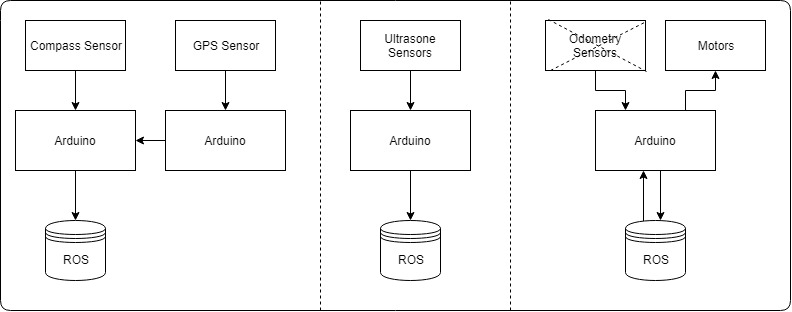
ros_gps gps sonar odometry

NOTE: It should be stated that the code for the odometry is currently removed.
The reason for this can be found in the https://Windesheim-Willy.github.io/WillyWiki/Technical/Hardware.html#_motors_and_controller[Technical Hardware document].

===== Code Overview
In this chapter the structure of the C code on the Arduino's can be found. These
schemes are not class diagrams, since C is not object-oriented.

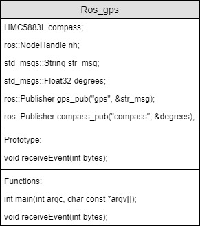

This is the code of the file in ros_gps. It is running on the Arduino connected
to ros. The compass sensor is attached to this Arduino.

image:../Archive/2018S1/Software/media/Arduino4.jpg[image,width=221,height=254]

This code reads out the GPS sensor and sends it with a serial connection to the
other Arduino (the one running ros_gps).

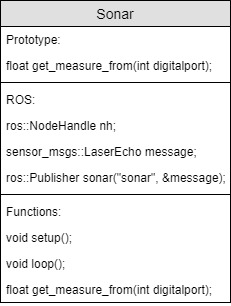

This is the code running the ultrasonic sensors. All the sensors have a digital pin.

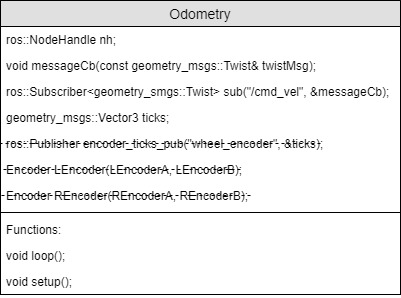

This is the code of the motor controller. It is called 'Odometry', but this part
is removed from the code. The code receives data from ROS and controls the motors
of the wheelchair by sending serial data to the built in wheelchair controller.

==== Design Decisions

In the past the decision has been made to make the hardware modular.
Unfortunately the reason behind this decision is not documented.

The motor controller (odometry) is made by the group of the second
semester of 2016/17. The odometry code subscribes from the topic
“/cmd_vel”. The code writes data it gets from ROS to the motors.

The sonar code was reading the 10 sonar sensors and publishes it to ROS
on the topic “sonar”. The code has been written by the group of the
second semester of 2016/17.

We updated the code so it uses 16 sensors, 6 for the front, 6 for the
back, and 4 for facing down to the ground to detect if Willy is driving
above a stair.

The GPS and compass code is written by the group of the first semester
of 2017/18. The setup is made ambiguous. The compass has a Arduino and
the GPS has a Arduino. The data from the GPS is sent to the Arduino with
the compass. From that Arduino the data from the Compass and the data
from the GPS is both being published to two separate ROS topics. The
topic with compass data is “compass” and the topic with GPS data is
“gps”. This setup has not been fixed yet.

=== Software

Here goes information about the code of the DrivingWilly ROS package

==== Overview

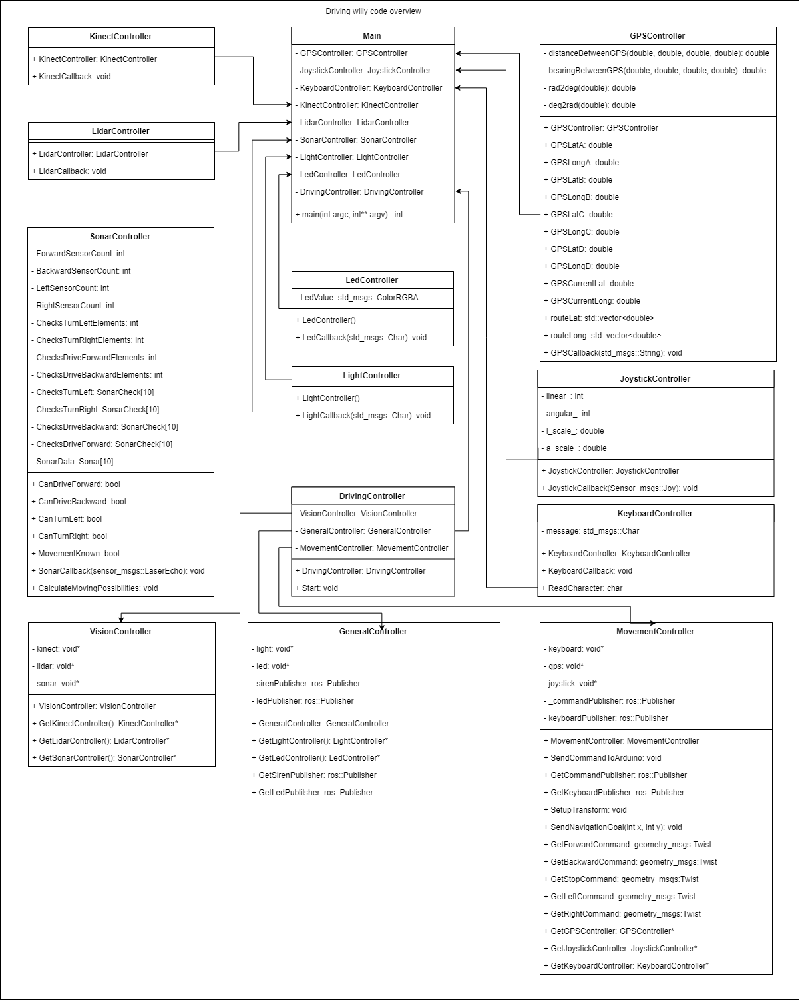

Our driving willy code consists of modulair components named controllers.
These controllers controls the functionality of willy. Every piece of hardware
has it's own controller which controls the methods and stores the variables.
A global class diagram can be found in the image above.

By using this way of coding, functionality of willy can be easily extended.
Just create a new controller and add your methods to it.
A detailed explaination of this can be found in the "Extending functionality"
paragraph on this page below.

==== Controller setup

Every controller is created and declared in the main. The main creates the class object
and returns a pointer to it.

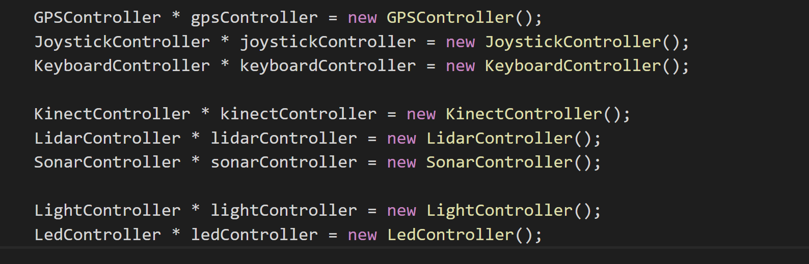

This pointer is forwarded to the controller of willy
named "DrivingController".

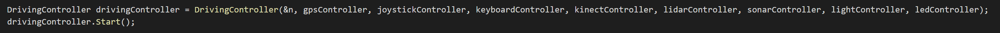

In this class the subcontrollers are declared.
The current subcontrollers of willy are:

1. VisionController
2. GeneralController
3. VisionController

The pointers of the controllers are forwarded to the subcontrollers above in the "DrivingController"

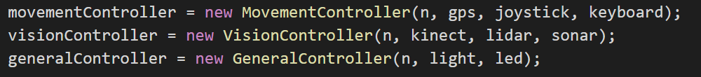

Now every controller has acces to their subscontroller and the subcontroller has acces to the main where the other controllers are declared.
By using this method we can always access all data and methods of the controllers and subcontrollers.
To make that possible, we have to send class object pointers between functions. Thats done by using the "static_cast" in C++

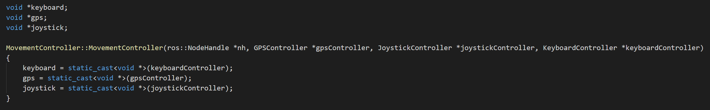

Above is an example of the "static_cast" in the "MovementController"

The "static_cast" make it possible to convert a void pointer back into a class object pointer without declaring the class again.

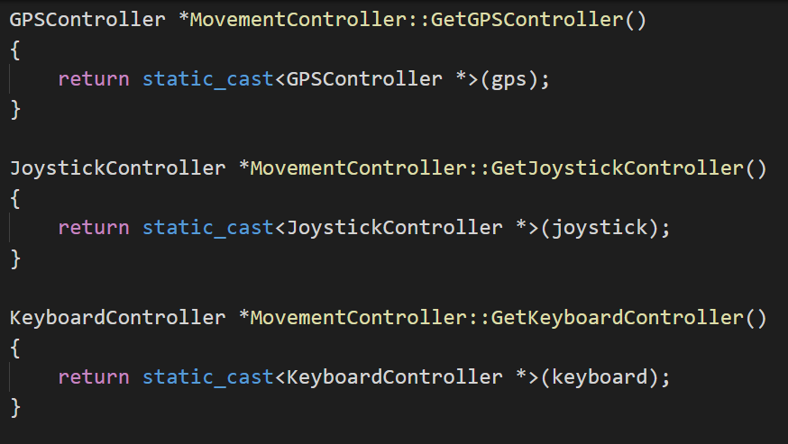

==== ROS setup

To make the communication between nodes easy accessibly, we created some advertisers and subscribers in the ROS cloud.

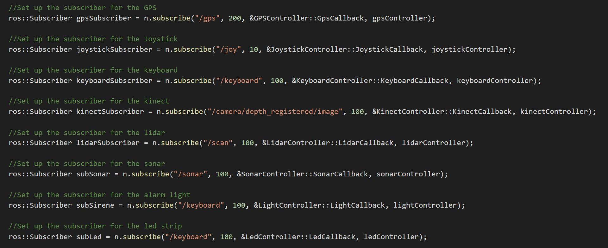
image:media/overview/Advertise.PNG[image,width=1000,height=77]

IMPORTANT: To see the basics of ROS and the general purpose, please visit our ROS generic wiki page on: //LINK TO ROS GENERAL page

These publishers and advertisers make it possible to push data generated by hardware to a rostopic, as example the sonar topic,
and read that data all over the code of willy. Because you can echo the rostopic data anywhere and anytime.

Using ROS we're able to push keyboard characters on the 'keyboard' topic and subscribe on the keyboard topic. This means that when the code is running
and you pressed a key, the function that you gave to the keyboard subscriber will be launched. In our code this means that the led lighting will turn red
if you press the 'r' button on the keyboard. The flowchart is shown on this page below.

*Always running (DrivingController)*
MovementController -> GetKeyboardController() -> ReadCharacter()

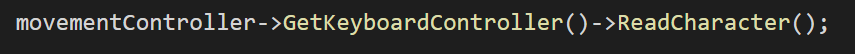

*Running when char received*
subLed() -> LedCallback() -> Advertise ColorRGBA on 'led' topic()

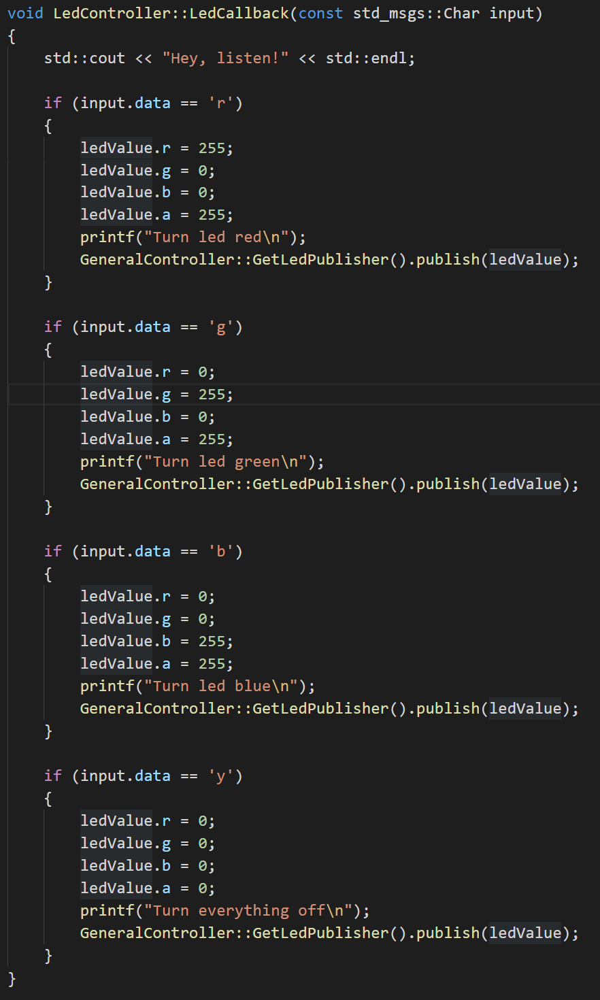

IMPORTANT: The following paragraph is about the ros navigation stack. To learn the basics about ros_navigation, see our ros navigation wiki page.

==== autonomous driving

The autonomous driving of Willy is controlled by external ROS plugins. These plugins are:

*Move_base* -> Used for sending Twist messages to Willy out of goals send to the ros navigation stack. +
*Hector_Mapping* -> Used for creating a map based on the LiDaR and transforms. +
*Sick_tim551* -> Used for initilization of the LiDaR and creating the /scan topic for the map. +
*Transform* -> Used the send the transformation and rotations from devices on the robot to the rotation point of the robot. +
*Kinect* -> Used for the recognition of people and creating the /camera topic. +
*Rviz* -> Used for visualization of the map and sensors on the base frame. +

All of these external plugin are started using the 'willy_navigation.launch'.

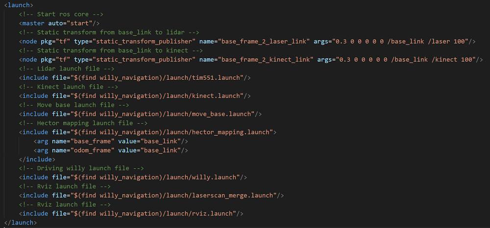

This file starts all of the external plugin launch files. All of these external launch files can be find in our git repository.

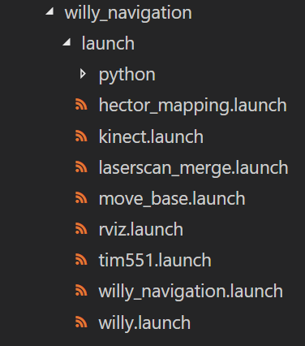

IMPORTANT: To learn more about the parameters in the launch files. See our 'parameter' wiki page.
