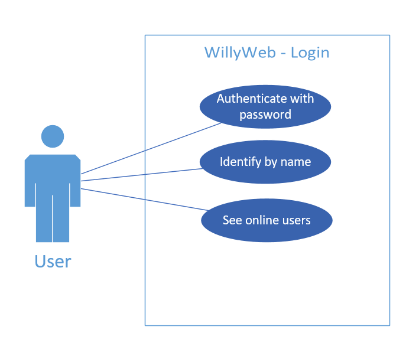
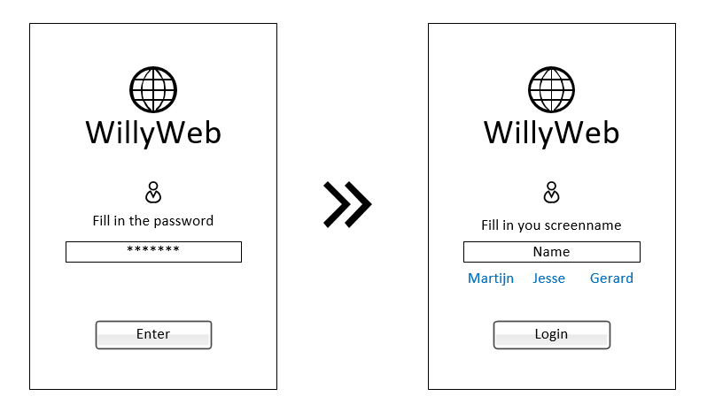
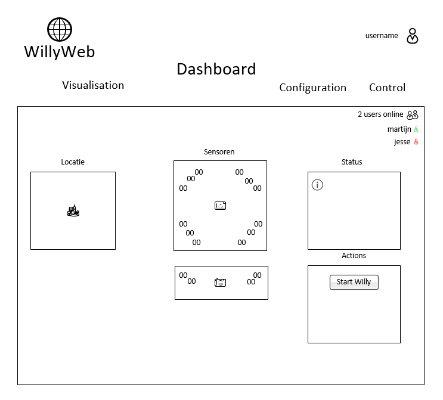
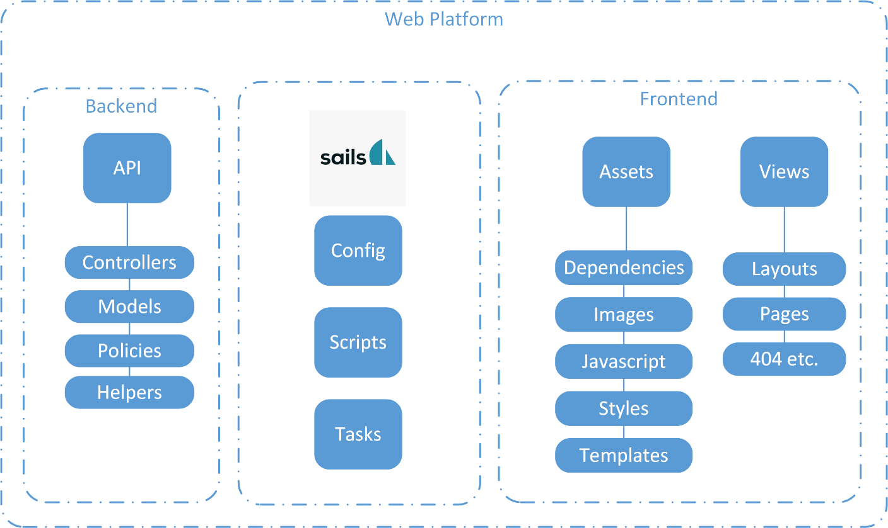

include::../Header.adoc[]

== Functional
The full Software architecture document can be found at link:{url}\Archive\2018S1\Software\SAD.pdf[]

=== Login
==== Use case

==== Use case description
*Authenticate with password*
A user must enter a password to authenticate.

*Identify by name*
A user must identify by entering a name

*See online users*
After authentication and identification a user must be able to see who else is using the platform and on which page they are or what they are doing.

==== Wireframe

==== Wireframe description
Login
The login screen is split up into two actions first authentication and then identification.

Authentication
On the left side the wireframe for authentication. It contains the following elements:
Type	Description	Purpose	Action
Image	Logo	Informative	None
Label	Fill in the password	Instruction	None
Password field	Password	Authentication	Enter password
Button	Authenticate	Authentication	Authenticate

Identification
On the right side the wireframe for identification. It contains the following elements:
Type	Description	Purpose	Action
Image	Logo	Informative	None
Label	Fill in your screenname	Instruction	None
Text field	Name	Identification	Enter a name
Button	Identify	Identification	Identify

=== Dashboard
==== Use case

==== Use case description
See ultrasonic senordata
A user must be able to readout the sensordata from ultrasonic sensors to check a certain distance between an object.

See current location
A user should be able to see the current location of Willy, indoors and outdoors if possible else it should display its latest position and time updated.

See current status
A user must be able to see Willy’s current status, which modules are correctly started and connected and which modules failed to start for example.

Startup Willy
With a press of a button a user should be able to turn Willy on, when doing this a user instruction should be presented.

==== Wireframe

==== Wireframe descriptions
Dashboard
The dashboard is split into 4 different sections one of which is the header at the top. The other 3 sections on the bottom of the page are location information, sensor information and information about the status including a few quick actions.

Header
The header located at the top of the wireframe contains the following elements:
Type	Description	Purpose	Action
Image	Logo	Informative	Go to Dashboard
Label	Username	Informative	None
Menu	Menu items	Navigation	Navigate to page
Text	Shows online users	Informative	None

Location information
At the far left of the wireframe the ‘location’ section contains the following elements:
Type	Description	Purpose	Action
Title	Location	Informative	None
Image	Map, shows surroundings	Informative	None
Image	Willy, Shows current location	Informative	None

Senor information
In the middle the sensor section contains the following elements:
Type	Description	Purpose	Action
Title	Sensors	Informative	None
Image	A image of Willy’s top view	Informative	None
Image	A image of Willy’s side view	Informative	None
Text	Sensor data of sensors around Willy	Informative	None
Text	Sensor data of sensors looking down from Willy	Informative	None

As an extra note, the sensor data is placed according to the sensor placement on Willy itself so the data represented for the real-life situation.

Status information & Actions
The section on the right side with the title ‘Status’ contains the following elements:
Type	Description	Purpose	Action
Title	Status	Informative	None
Text	Status information	Informative	Show more information
Image	A symbol shows the urge of each status information	Informative	None

The section on the right side with the title ‘Status’ contains the following elements:
Type	Description	Purpose	Action
Title	Actions	Informative	None
Button	For example: Start Willy	Launch action	Launch specified action

=== Control
==== Use case

==== Use case description
Control Willy
A user should be able to control Willy manually. This can come in handy when Willy needs to be moved in specific directions or in spaces it normally wouldn’t operate such as on a fair.

See current speed
A user should be able to see the current speed of Willy while driving manually

See current status
A user should be able to see Willy’s current status, for example show senor data to avoid collisions.

=== Visualisation
==== Use case

==== Use case description
See 2d map from RVIS
A user should be able to see the 2d map generated from the sensor input using RVIS. This is to be able to remotely monitor the space around Willy and for debugging purposes.

See current indoor location
On this 2d map the location of Willy should be shown.

See current status
A user should be able to see Willy’s current status, for example show senor data to avoid collisions.

=== Configuration
==== Use case

==== Use case description
See current config
A user should be able to see the current parameters set in the config

Change config parameters
A user should be able to change these parameters, without being able to enter wrong input values.
