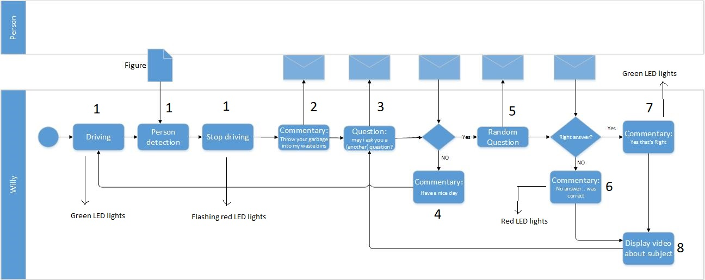
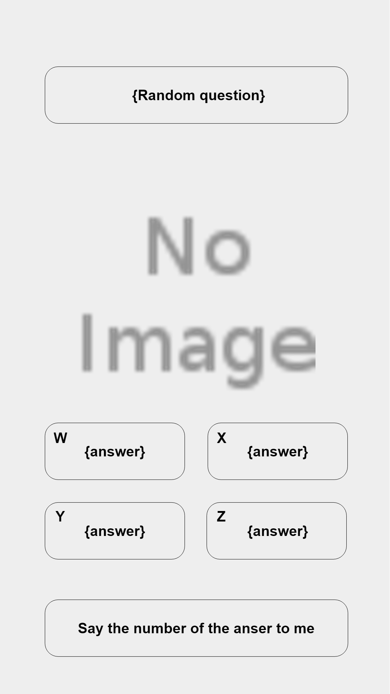
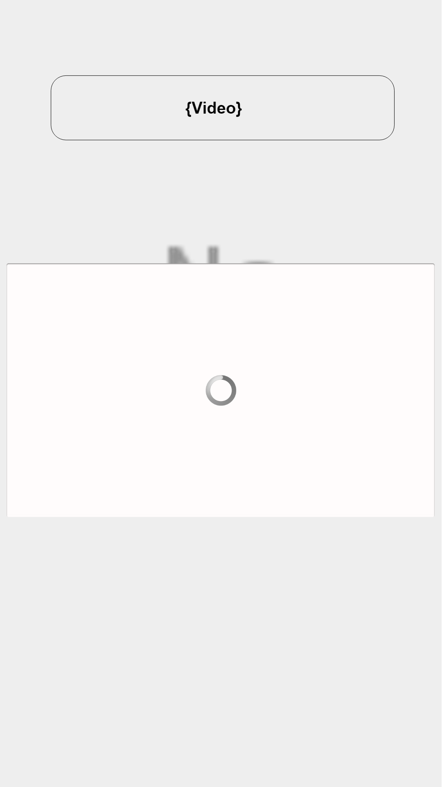
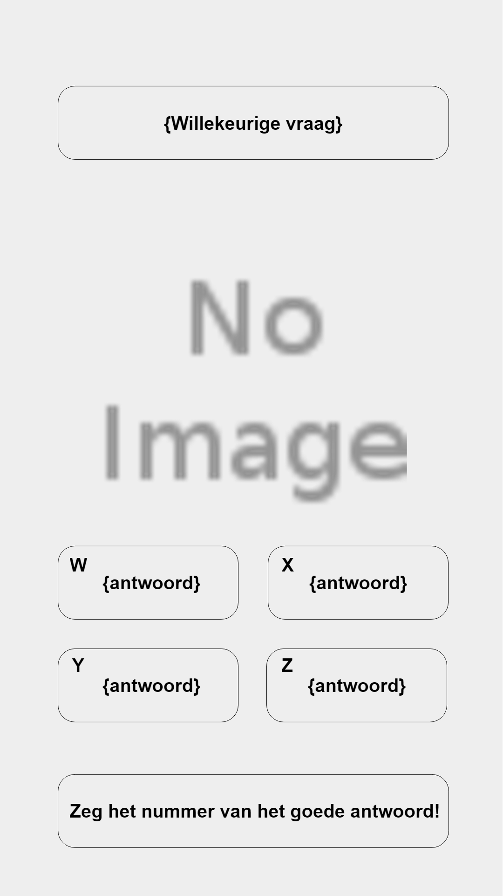
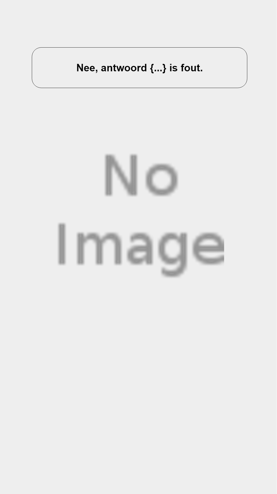

include::../Header.adoc[]

== Interaction

=== Flow Chart

=== Screen Designs

==== English

1. This is the screen shown when Willy is driving around, and there is not yet a person to interact with.
+

2. This screen is shown when a person is starting to interact with Willy. At the bottom there are two arroys pointing to the garbage bins.
+

3. After that Willy asks permission to ask a question to the person in front of Willy.
+

4. When the person says 'no', then this screen is shown, after wich the robot continues driving.
+

5. When the person says 'yes', a random question is shown with a number of multiple choise answers.
+

6. When the given answer is wrong, this screen is shown.
+

7. When the given answer is right, this screen is shown.
+

8. After the question, Willy starts to play an informative video about garbage.
+

==== Dutch
For comments at each image, see the English version above.

1. image:media/screen_designs/nl/1.png[image,width=300]
2. 
3. 
4. 
5. 
6. 
7. 
8. image:media/screen_designs/nl/8.png[image,width=300]

==== Speech configuration

`curl -sL https://deb.nodesource.com/setup_9.x | sudo -E bash -`

`sudo apt-get install -y nodejs`

`sudo apt-get install -y build-essential`

`sudo apt-get install python-pyaudio python3-pyaudio sox`

`pip install pyaudio`

`sudo apt-get install libmagic-dev libatlas-base-dev`

`git clone https://github.com/Windesheim-Willy/Speechtest.git`

`cd Speechtest`

`node server.js`

