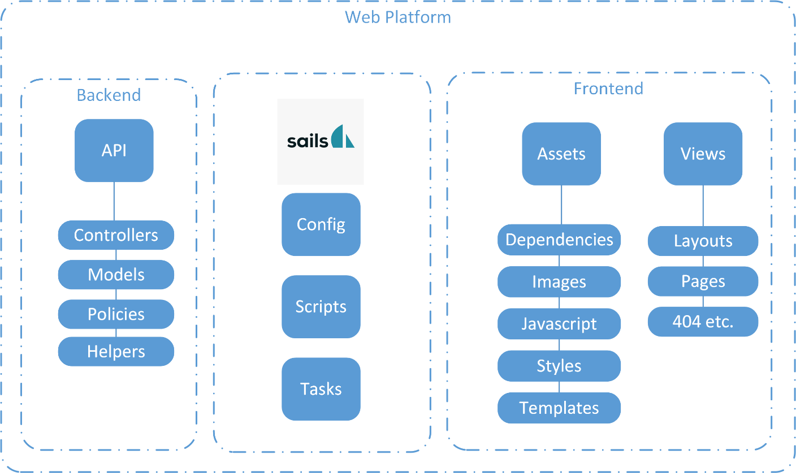

include::../Header.adoc[]

== Technical
The full Software architecture document can be found at link:{url}\Archive\2018S1\Software\SAD.pdf[]

=== Logical Overview

==== ERD
 image::media/sad/image4.png[]

===== Clarification
It might seem quite minimal but the User object is the only model used as of the moment of writing. It is also because most of the objects created are not linked to a user model but rather to a RosNodeJS message type, and these messages are directly send to ROS and not saved in a model of some sort.

===== User
The user model contains by default an ‘id’, ‘createdAt’ and ‘updatedAt’ attributes. The attributes mainly used in the model are the ‘name’ attribute, this is the username which the user used to identify. The attribute ‘currentpage’ keeps track of the page each user is on and the ‘session’ attribute contains the session id so the application can track the users among API calls.

==== Domain Model
This would be the same as the ERD, see the clarification for more details.

 
==== Class Diagram

===== MVC & RosNodeJS
SailsJs is based on the Model – View – Controller framework (MVC) because of this all those parts are separate from each other and it is able to test these individually. But because RosNodeJS is used the Model is often missing in this workflow because ROS uses message objects which are used throughout the application. Often you will see a controller who talks to ROS and this data is directly used in the View, a visualization of this is made in the following activity diagram.

 
In this example a request for data is send by the user, for example by clicking a button or visiting a page. This request is send via a socket to a controller, this controller subscribes on a Rostopic to receive the data ROS is publishing on the specific topic. When the data is received it is published on a socket with the updated data. Good to know is that this occurs in a loop, and this loop continues until a request for unsubscribing is received. This would more or less look like the following diagram.
  
===== Class diagram
A full overview of how a SailsJs environment looks like see https://sailsjs.com/documentation/anatomy. The following diagram focusses on the specifics for WillyWeb.

 
Models
As described in the ERD section the user is the only model in use at the moment of writing. For a full description read the user section in chapter ERD.

Controllers
Page controllers
The page controllers act as controllers for each page view.

API controllers
The api controllers act as controllers who take care of the ROS communication. An example of this is shown in the previous section about MVC & RosNodeJs. As seen in the diagram above these classes contain RosNodeJS in a variable, this is done using NodeJs require function. 

Specific for the ‘StatusController’ a requirement of the procces is required to execute commands in the operating system.

Views
To complete the diagram as seen above the views should be added. However these are not classes and in such case not shown in a class diagram. The view is rather a html file with  But for illustration purposes it would look like the following diagram:
 
Views
All the .ejs files are embedded Javascipt files, this is the default for SailsJS but could also be html or any other format if you’d like to. Because VueJs is used the use of Embedded Javascript is very limited.

Also the views are separated by folders, to make a difference in files that facilitate the layout and files that are the actual pages.

Assets
This separation is the same for the assets. The assets contain JavaScript files that coordinates all the updates that are done in the view.

Dependencies
In the folder structure of the assets folder you can also find the dependencies.

 
=== RosNodeJS

==== Introduction
RosNodeJs is a framework in which you can create real ROS Nodes. It is good to have basic knowledge about ROS before reading any further. This can be read on the Wiki and at the official website http://www.ros.org/. 

RosNodeJs lacks in a proper documentation but the official wiki is available on ROS’s own website, see http://wiki.ros.org/rosnodejs/overview. 

==== How to use
RosNodeJs functions as a ROSPackage, the instance of WillyWeb is run as a RosPackage named ‘willyweb’. However you are able to run multiple instances of the Rospackage ‘willyweb’ for example if you run multiple scripts. More on this can be read on the Wiki (https://artofrobotics.github.io/WillyWiki/WEB/). 

==== Implementation
Declaration
Ros is used as a NPM package and is loaded into a controller using the following code:
 
Here in the first line of code RosNodeJs is loaded into the constant variable ‘rosnodejs’. In the second line the type of message is defined, in this case ‘sensor_msgs’.

===== Node Handle
In the following section of code these variables are used as following:
 
In the third line of code you can see an if statement that checks if a so called Node Handle already exist. A Node Handle is the Node on which the platform operates, you could also see this as the Rospackage ‘willyweb’ but then in a active node. You would expect that this is not needed because you require the same RosNodeJs module across the application but research found out this does not work as of the moment of writing. 

If a Node Handle already exits the node can be accessed using ‘rosnodejs.nh’. If this Handle does not yet exist it awaits the creation of it using ‘rosnodejs.initnode(‘/willyweb’)’.

The main reason this is done each time RosNodeJs is used in the code is because the same instance must be used over the whole application. Multiple Node Handles cannot coexist. The official examples given are also written inside one function, this is not practical for a well designed application. Another solution was therefore to create a RosController in which all communication with Ros would be done. The main disadvantage of this is that you’ll have to create a function for each and every message type used throughout the application which violates the Single responsibility principle in the SOLID principles.

===== Subscribing
If the Node Handle is initialised we can use the various functions ROS uses, for example subscribe:
 
In the first line the subscribe method is called with the first parameter being the topic on which it must subscribe ‘/sonar’ and next up the message type ‘msg.LaserEcho’ after that the function is declared on what to do when data is published on the topic. This data is stored in the local variable ‘data’, in the current situation it would blast an update over the socket that new data is available. This update also contains the new data received form the topic.

===== Advertise
Before being able to publish onto a ROS topic we first need to advertise that we are going to publish data. This is done using the advertise function on the Node Handle:
 
First a variable is made so that the advertise topic can be reused inside the controller.
 
After that the variable is filled with a advertise topic, the function advertise consist out of 2 parameters in this case the topic to advertise on ‘/led’ and a message type ‘msgs.ColorRGBA’.
Publishing
After the initialisation of the advertise topic the following function is used to publish data onto this ROS topic:
 
In this example the earlier variable ‘pub’ is reused to call the function publish on the advertise topic. This function contains the data in JSON format that needs to be published onto the topic. Make sure this data is coherent to the official format used by the specific message type which can be found at ROS official wiki: http://wiki.ros.org/common_msgs?distro=kinetic 
=== Design Decisions

==== NodeJS
The previous web platform used many different languages, C#, Python and NodeJs which made code management a hassle. Because NodeJS was already used in the Front-end the choice was made to do the same for the backend. The original choice to use C# as backend was mainly due to the use of SignalR which, according to the previous group was the only option to send updates from the server to the client. However it is found that this is not true because Socket.IO offers the same functionality in NodeJs. Another benefit of using NodeJs is that the same language can be used for the frontend as well as the backend which makes the code more maintainable. Also a recent publication of a ROS framework for NodeJs made the choice even more argumentative because it eliminates the use of RosBridge. (Socket.io, 2018) (NodeJS, 2018) (Projectgroup, 2018)

==== RosNodeJS
RosNodeJS is a framework that allows a NodeJS application to talk to ROS as if it was a part of ROS. This eliminates the use of RosBridge, which is a python module and acts as an API for ROS. The main advantage of RosNodeJS is that you are already operating as a rospackage inside the ROS system. This makes it quicker and reliable by sending and receiving messages to various ROS nodes. It also makes it possible to set parameters from within ROS itself without going through an API. Another disadvantage of using ROSBridge is the slow serialization and deserialization of ROS messages. Of course RosNodeJS also needs to serialize these messages but without going through a separate API the speed is substantially increased. (Smith, RosNodeJS talk RosCon 2017, 2017) (Smith, RosNodeJS Github, 2018) (RethinkRobotics, 2017) (Projectgroup, 2018)

==== SailsJs
After prototyping with different NodeJS platforms, SailsJs was by far the easiest to start with. Due to its ease of API creation you are able to rapidly prototype a real api without the need of extra lines of code to create it. It is also fully customizable in the long run if the generated API does not fulfill the requirements of the application anymore. Sails also has a built-in integration with Socket.IO which makes it easier to use sockets. (SailsJS, 2018)

==== VueJS
VueJS was chosen, because previously Angular was used as a front-end framework. But Angular requires specific knowledge and has a steep learning curve, VueJs however combines the best of all worlds by being simple and offering standalone usage trough code. This makes for fast development using a Vue instance. SailsJs also offers good support for VueJS. (SailsJS, 2018) (VueJS, 2018)

=== References
NodeJS. (2018). NodeJS docs. Opgehaald van https://nodejs.org/en/docs/
Projectgroup, R. 2. (2018). Inventory Current status of Willy. 
RethinkRobotics. (2017). RosCon 2017 RosNodeJs sheets. Opgehaald van https://roscon.ros.org/2017/presentations/ROSCon%202017%20rosnodejs.pdf
SailsJS. (2018). Opgehaald van SailsJS: https://sailsjs.com/
Smith, C. (2017). RosNodeJS talk RosCon 2017. Opgehaald van https://vimeo.com/236189788
Smith, C. (2018). RosNodeJS Github. Opgehaald van https://github.com/RethinkRobotics-opensource/rosnodejs
Socket.io. (2018). Socket.io Docs. Opgehaald van https://socket.io/docs/
VueJS. (2018). VueJS. Opgehaald van https://vuejs.org/ 

