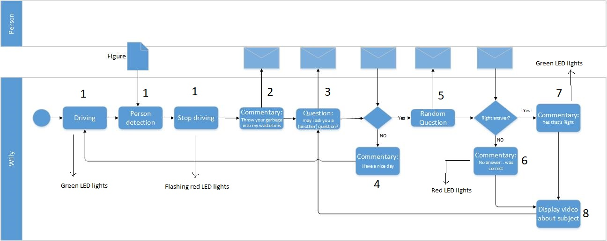
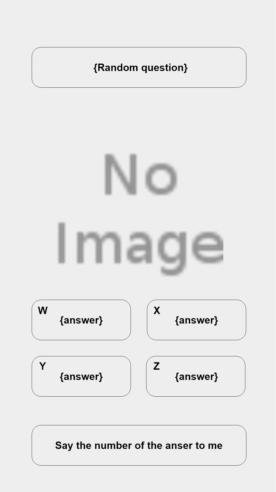

include::../Header.adoc[]

== Software Technical Document

=== Flow Chart

=== Screen Designs

==== English

1. image:media/screen_designs/en/1.png[image,width=300]
2. image:media/screen_designs/en/2.png[image,width=300]
3. 
4. image:media/screen_designs/en/4.png[image,width=300]
5. 
6. image:media/screen_designs/en/6.png[image,width=300]
7. image:media/screen_designs/en/7.png[image,width=300]
8. image:media/screen_designs/en/8.png[image,width=300]

==== Dutch

1. image:media/screen_designs/nl/1.png[image,width=300]
2. image:media/screen_designs/nl/2.png[image,width=300]
3. image:media/screen_designs/nl/3.png[image,width=300]
4. image:media/screen_designs/nl/4.png[image,width=300]
5. image:media/screen_designs/nl/5.png[image,width=300]
6. image:media/screen_designs/nl/6.png[image,width=300]
7. image:media/screen_designs/nl/7.png[image,width=300]
8. image:media/screen_designs/nl/8.png[image,width=300]
