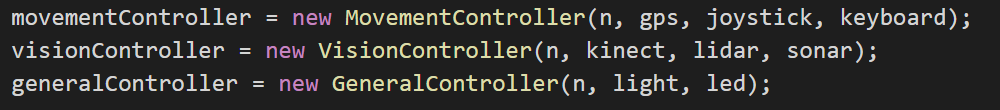
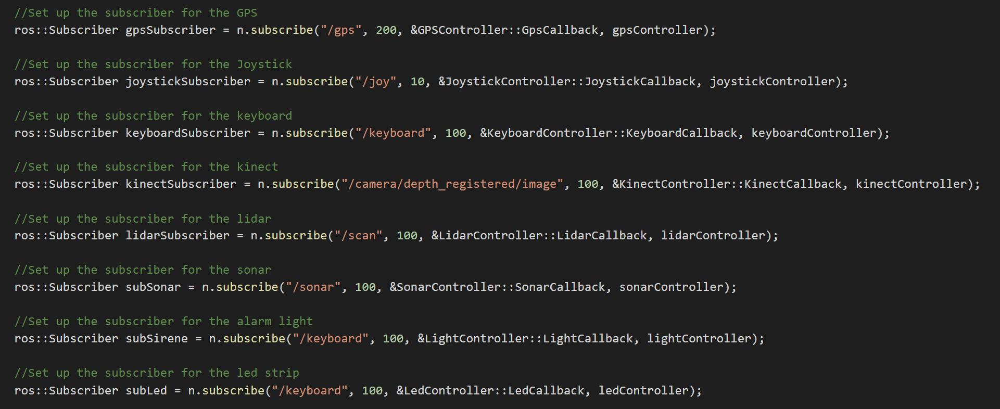
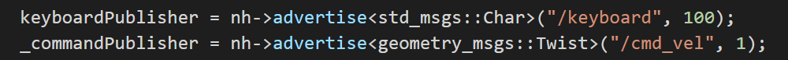

include::../Header.adoc[]

== Code Overview Documentation

=== Hardware

Here goes information about the code of the arduino's in willy

==== Overview

=== Software

Here goes information about the code of the DrivingWilly ROS package

==== Overview

image:media/overview/DrivingWilly.png[image,width=1200,height=1500]

Our driving willy code consists of modulair components named controllers. 
These controllers controls the functionality of willy. Every piece of hardware
has it's own controller which controls the methods and stores the variables.
A global class diagram can be found in the image above.

By using this way of coding, functionality of willy can be easily extended.
Just create a new controller and add your methods to it.
A detailed explaination of this can be found in the "Extending functionality" 
paragraph on this page below.

==== Controller setup

Every controller is created and declared in the main. The main creates the class object 
and returns a pointer to it. 

image:media/overview/ControllerDeclaration.png[image,width=1588,height=520]

This pointer is forwarded to the subcontroller of willy
named "DrivingController". 

image:media/overview/DrivingController.png[image,width=2708,height=90]

In this class the subcontrollers are declared.
The current subcontrollers of willy are:

1. VisionController
2. GeneralController
3. VisionController

The pointers of the controllers are forwarded to the subcontrollers above in the "DrivingController"

Now every controller has acces to their subscontroller and the subcontroller has acces to the main where the other controllers are declared.
By using this method we can always access all data and methods of the controllers and subcontrollers.
To make that possible, we have to send class object pointers between functions. Thats done by using the "static_cast" in C++

image:media/overview/sc.png[image,width=2290,height=360]

Above is an example of the "static_cast" in the "MovementController"

The "static_cast" make it possible to convert a void pointer back into a class object pointer without declaring the class again.

==== ROS setup

To make the communication between nodes easy accessibly, we created some advertisers and subscribers in the ROS cloud.

IMPORTANT: To see the basics of ROS and the general purpose, please visit our ROS generic wiki page on: //LINK TO ROS GENERAL page

These publishers and advertisers make it possible to push data generated by hardware to a rostopic, as example the sonar topic, 
and read that data all over the code of willy. Because you can echo the rostopic data anywhere and anytime.

Using ROS we're able to push keyboard characters on the 'keyboard' topic and subscribe on the keyboard topic. This means that when the code is running
and you pressed a key, the function that you gave to the keyboard subscriber will be launched. In our code this means that the led lighting will turn red 
if you press the 'r' button on the keyboard.

===== Always running (DrivingController)
MovementController -> GetKeyboardController() -> ReadCharacter()

image:media/overview/rc.png[image,width=855,height=54]

===== Running when char received
LedSub() -> LedCallback() in LedController -> Advertise ColorRGBA on 'led' topic()

image:media/overview/lb.png[image,width=882,height=1470]
