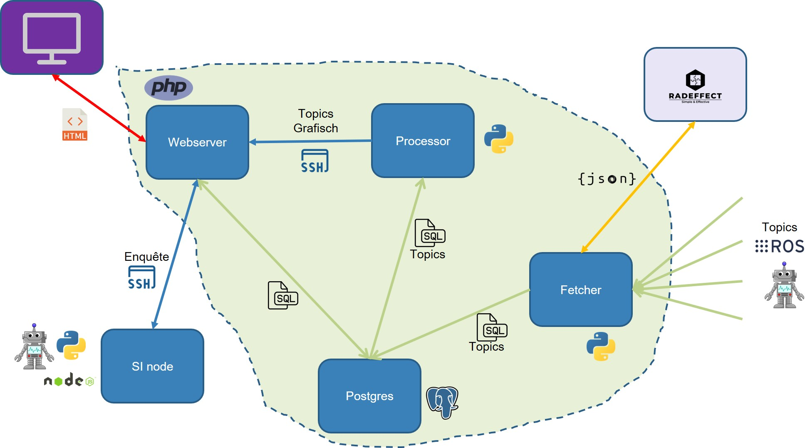

include::../Header.adoc[]

== Skylab Architecture

=== Standpoints

The Skylab architecture is design with a set of standpoints just as the hardware and software architecture.
 
* Skylab can give limited resources to a node, therefore modulairity is essential. All solutions in Skylab should be built with scale out possibility in mind.
* Skylab is the place for all not vital functions of Willy.
* Skylab is seen as a redundant environment with high enough up-time. There is no need for dual datacenter architecture.
* Variations of OS software is possible as long as topic communication is possible.
* Variations of ROS software is possible as long as topic communication is possible.
* Simultaneous development is possible.
* Skylab communicates safely with Willy.
* Skylab has limited port connection to the Internet, fi mail anf FTP is is not possible.
* Skylab supplies for ROS Topic fetcher, PostgreSQL and Webserver services. Additional nodes are used for all sorts of processing like Data Sciense and RADeffect connectivity.

=== Design

These standpoints resulted in the following hardware design. 

=== Usability

By having multiple VPN instances, its possible - if all hardware is powered on - to connect through Skylabs to the individual hardware nodes on Willy even if not physically near him. Another option is to physically connect to WillyLAN and access either Skylab or Willy hardware nodes. 

[NOTE]
Designing this architecture and keeping it up to date can be done by editing the pptx file in Microsoft PowerPoint on the SharePoint site of Willy.
