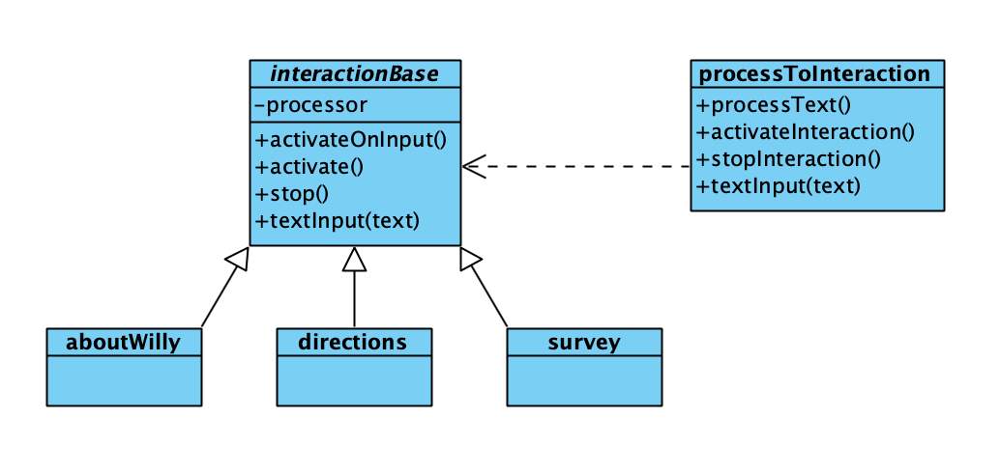
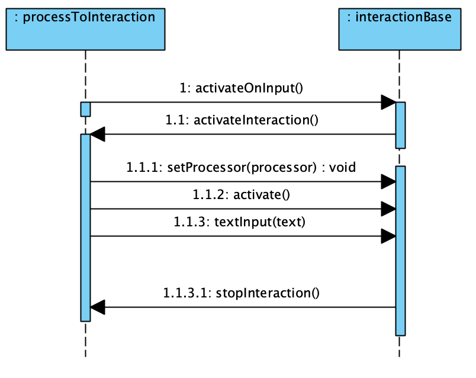
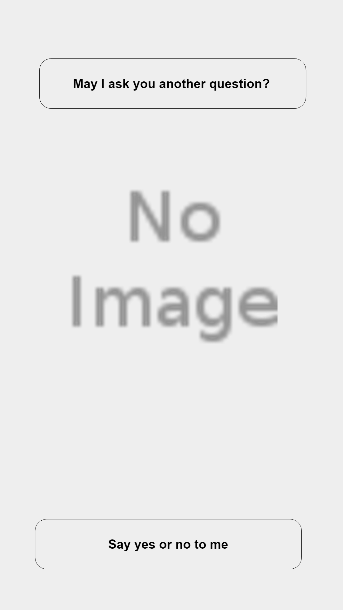
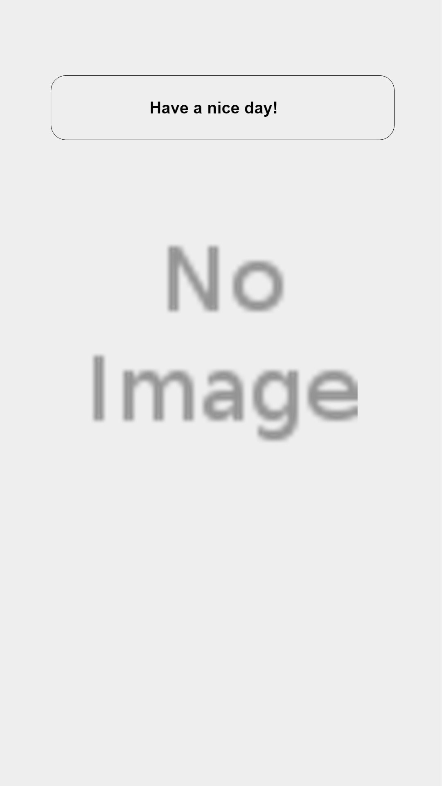
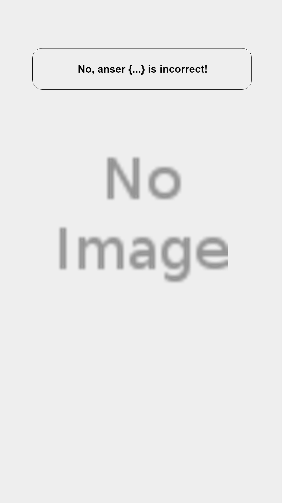
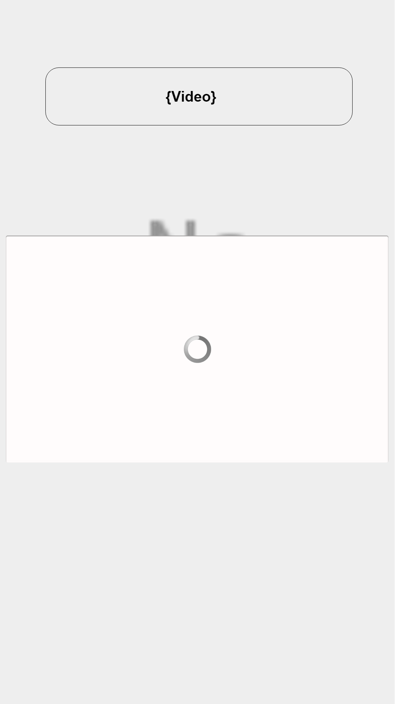

include::../Header.adoc[]

== Social interaction
The social interaction creates the interaction of Willy. He listens and speaks with people.

The social interaction is build with NodeJS. NodeJS has a webserver and connects with web sockets to the frontend of Willy. The NodeJS server processes all information of the interactions and passes this to the frontend. The frontend doesn't contains any logic of the social interaction, only the logic of displaying information to the website.

=== Repository
====
https://github.com/Windesheim-Willy/social_interaction[Windesheim-Willy/social_interaction, role="external", window="_blank"]
====

=== How to run?
[source,shell]
----
./START start
----

==== Nodejs packages (npm)
Never run `npm install` outside the Docker container to prefent OS conflicts between the Nodejs packages.

Run the npm install command:
[source,shell]
----
npm install
----

==== Stylesheets
The source files for the stylesheet are written in SASS. The should be compiled to CSS files what a browser can process.
Gulp compiles the SASS files to CSS files.

Compile only once the SASS file:
[source,shell]
----
npm run sass:build
----

Compile the SASS file on every file change:
[source,shell]
----
npm run sass:watch
----

=== Websocket API
API documentation for the connection between de NodeJS server and frontend.

[options="header"]
|=======================
|Name|Purpose|Type|Example data
|changeMood|Change the body class of the website|String|blue
|changeFormat|Change the format of the content and Willy image wrapper|Object|
{willy_height: '80%', content_height: '20%'}
|changeContent|Change the content below Willy|String|<h1>Hi!</h1>
|textInput|All the text input will be pushed|String|hello willy
|=======================

=== Social interaction Flow

image:assets/social_interaction/flow.png[image]

=== Interactions of Willy
The interaction has multiple type of interactions.

==== About Willy
Tell information about Willy and show the image of Willy.

==== Information with a map
Show a map at the frontend of Willy.

The map requires a image file which will be shown to the user. This file should be located at the path `public/assets/map.png`.

==== Information with the schedule
Show a image with the schedule at the frontend of Willy.

The schedule requires a image file which will be shown to the user. This file should be located at the path `public/assets/schedule.png`.

==== Information with the directions
Show a image with the directions at the frontend of Willy.

The map requires a image file which will be shown to the user. This file should be located at the path `public/assets/directions.png`.

==== Survey
Take a survey with Willy. The user can ask for the survey and Willy will ask the questions.

===== Survey questions
Survey information file `src/interactions/assets/survey.json`.
The information file contains the name, description and author of the survey.

Survey questions file `src/interactions/assets/survey.csv`.
The questions file contains all the questions for the survey.

===== Survey answers
Survey answers `src/interactions/assets/survey_answers.csv`.

=== ROSNodeJs
link:{url}/Components/social_interaction/rosnodejs.html[Read the information about the ROSNodeJs]

=== Diagrams interactions

Class diagram:

NodeJS has no interfaces, so the application connects to a instance of the interaction base.

Sequence diagram:

=== Screen Designs

==== English

1. This is the screen shown when Willy is driving around, and there is not yet a person to interact with.
+
image:assets/social_interaction/screen_designs/en/1.png[image,width=300]
2. This screen is shown when a person is starting to interact with Willy. At the bottom there are two arroys pointing to the garbage bins.
+
image:assets/social_interaction/screen_designs/en/2.png[image,width=300]
3. After that Willy asks permission to ask a question to the person in front of Willy.
+

4. When the person says 'no', then this screen is shown, after wich the robot continues driving.
+

5. When the person says 'yes', a random question is shown with a number of multiple choise answers.
+
image:assets/social_interaction/screen_designs/en/5.png[image,width=300]
6. When the given answer is wrong, this screen is shown.
+

7. When the given answer is right, this screen is shown.
+
image:assets/social_interaction/screen_designs/en/7.png[image,width=300]
8. After the question, Willy starts to play an informative video about garbage.
+

==== Dutch
For comments at each image, see the English version above.

1. image:assets/social_interaction/screen_designs/nl/1.png[image,width=300]
2. image:assets/social_interaction/screen_designs/nl/2.png[image,width=300]
3. image:assets/social_interaction/screen_designs/nl/3.png[image,width=300]
4. image:assets/social_interaction/screen_designs/nl/4.png[image,width=300]
5. image:assets/social_interaction/screen_designs/nl/5.png[image,width=300]
6. image:assets/social_interaction/screen_designs/nl/6.png[image,width=300]
7. image:assets/social_interaction/screen_designs/nl/7.png[image,width=300]
8. image:assets/social_interaction/screen_designs/nl/8.png[image,width=300]
