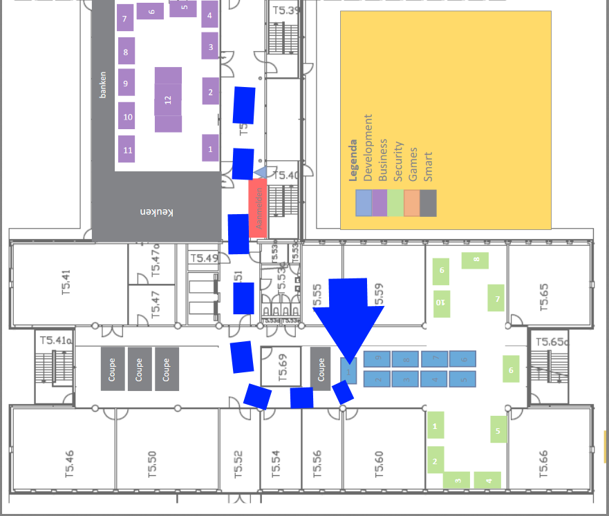

include::Header.adoc[]

image:https://travis-ci.org/Windesheim-Willy/WillyWiki.svg?branch=master["Build Status", link="https://travis-ci.org/Windesheim-Willy/WillyWiki"]

= Welcome

Welcome to project Willy. Before starting the project it is useful to know a few things about the project. Our first advice is to become acquainted with Willy.
Follow our WillyWiki from begin to end and try to understand how to use Willy.

== Wiki
Documentation on the Wiki contains all the details about Willy and the project.
If certain details about design decisions, configuration, hardware or other components about Willy cannot be found, more details can be found on Google Drive.

[NOTE]
--
This wiki is public and should not contain any private information nor passwords.
--

[TIP]
--
Use Github's search to find certain keywords in the content of the wiki. link:https://github.com/Windesheim-Willy/WillyWiki[Github WillyWiki]
--

[TIP]
--
For more information about Willy's previous life as garbage collector view link:https://artofrobotics.github.io/WillyWiki/[Willy the garbage collector]
--

== Winnovation
Project Willy is found at Windesheim Campus on T5, walking route is seen below:

== Status

The table below shows all the milestones and their current status.

[width="100%",options="header,footer"]
|====================
|Milestone  |Researched  |Realized  |Tested  |Category
|Assessment current status|Done  |Done  |Done  |Documentation
|Willy Improvisation  |Done  |Done  |Done  |Hardware Software Documentation
|Design  |Done  |Done  |Done  |Software
|WillyWiki    |Done  |Done  |Done  |Software
|Willy web | Done | Done  | Done  | Software
|Indoor navigation  |Done  |Done  |In progress (fine tuning)  |Software Hardware
|Plating | Done  | Done |  |Hardware
|Social interaction |Done  |In progress  |  |Software
|====================

